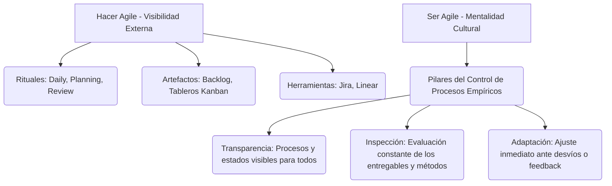

# Fundamentos de Agile y Cultura

> [!NOTE]
> **Enfoque de Ingeniería y Liderazgo Técnico (Big Tech Mindset)**  
> En las entrevistas de Big Tech (ej. Google, Meta, Amazon), no basta con listar los roles y artefactos de Scrum. Las preguntas situacionales buscan evaluar cómo equilibras la velocidad de entrega contra la calidad del código, cómo gestionas la incertidumbre y de qué manera ejerces un liderazgo sirviente en equipos multifuncionales autoorganizados.

---

## Comparativa: Gestión Tradicional (Predictiva) vs. Gestión Ágil (Adaptativa)

En la gestión tradicional, se asume que el alcance es fijo al inicio del proyecto y que el tiempo y el costo son variables estimadas. En el desarrollo ágil, el paradigma se invierte: el tiempo y el costo son fijos (Sprints fijos, equipos dedicados), mientras que el alcance es variable y se prioriza continuamente según el valor entregado.

| Dimensión | Enfoque Tradicional (Cascada / Predictive) | Enfoque Ágil (Adaptativo / Agile) |
| :--- | :--- | :--- |
| **Foco Principal** | Cumplimiento del plan y del proceso establecido. | Entrega continua de software funcionando y valor de negocio. |
| **Gestión del Alcance** | Fijo al inicio. Los cambios requieren un riguroso control formal. | Variable y dinámico. Se refina en cada ciclo (Backlog vivo). |
| **Gestión del Tiempo y Costo** | Variables calculadas basándose en el alcance inicial. | Fijos (Sprints fijos de 1-4 semanas, equipo con capacidad estable). |
| **Mitigación de Riesgos** | Análisis preventivo inicial extenso. Alto riesgo al final (fase de integración). | Mitigación empírica iterativa con integraciones diarias e incrementos de software. |
| **Rol del Líder** | Comando y control; asignador de tareas y supervisor del plan. | Líder sirviente; facilitador de autonomía, remoción de impedimentos. |

### El Triángulo de Hierro Invertido

```text
    TRADICIONAL (Cascada)                 ÁGILE (Adaptativo)
      Alcance (Fijo)                     Tiempo & Costo (Fijo)
     /            \                        /            \
    /              \                      /              \
   /________________\                    /________________\
  Tiempo & Costo (Variables)               Alcance (Variable)
```

---

## El Manifiesto Ágil y sus 12 Principios: Análisis de Trade-offs

El Manifiesto Ágil (2001) define cuatro valores fundamentales. Cada valor tiene un trade-off implícito que un líder técnico debe gestionar:

1. **Individuos e interacciones sobre procesos y herramientas**  
   * *Trade-off:* Fomenta la agilidad de comunicación y el alto rendimiento, pero requiere alta madurez en el equipo. La falta de procesos o herramientas consistentes puede provocar desalineación y dificultades de escala a nivel organizacional.
2. **Software funcionando sobre documentación exhaustiva**  
   * *Trade-off:* Minimiza el desperdicio (*waste*) y acelera el *time-to-market*. Sin embargo, la ausencia de documentación de arquitectura clave incrementa la curva de aprendizaje para nuevos ingenieros y puede generar deuda técnica acumulada.
3. **Colaboración con el cliente sobre negociación contractual**  
   * *Trade-off:* Minimiza el riesgo de construir el producto equivocado. Sin embargo, puede generar incertidumbre en los presupuestos comerciales rígidos y requerir la participación constante de los interesados comerciales.
4. **Respuesta ante el cambio sobre seguir un plan**  
   * *Trade-off:* Permite pivotar rápidamente ante oportunidades del mercado. No obstante, reduce la predictibilidad a largo plazo y puede causar fatiga en el equipo de desarrollo si las prioridades cambian con excesiva frecuencia.

---

## "Hacer" Agile vs. "Ser" Agile: La Cultura del Empirismo



* **Hacer Agile (Prácticas y Procesos):** Seguir mecánicamente los rituales (ej. Daily Standup de 15 minutos, Sprints de dos semanas). Es fácil de implementar pero inútil si la cultura de base no cambia.
* **Ser Agile (Mentalidad y Valores):** Adoptar el control de procesos empírico. Se basa en que las decisiones se toman a partir de hechos observados y la experiencia real, no en predicciones iniciales.

---

## Roles en Scrum: Estructura de Responsabilidades en Ingeniería

### 1. Product Owner (PO)
* **Gobernanza:** Es el dueño del *Product Backlog* y el único responsable de definir el "Qué" y el "Por qué".
* **Trade-off de relación:** Un PO ausente bloquea las decisiones técnicas y de negocio cotidianas del equipo de ingeniería. Un PO sobreinvolucrado (micromanager) limita la autoorganización del equipo técnico sobre el "Cómo".

### 2. Scrum Master (SM)
* **Gobernanza:** Facilitador y experto del marco de trabajo. No asigna tareas ni controla al equipo; actúa como un líder sirviente que remueve impedimentos y protege el foco del equipo de desarrollo.
* **Trade-off de relación:** Un SM débil permite que los stakeholders interrumpan constantemente el Sprint Backlog. Un SM excesivamente dogmático puede entorpecer la flexibilidad operativa del equipo.

### 3. Development Team (Equipo de Desarrollo)
* **Gobernanza:** Equipo multifuncional y autoorganizado responsable de entregar un incremento de producto potencialmente desplegable al final de cada Sprint. Tienen la última palabra sobre el "Cómo" técnico y la estimación de esfuerzo.

---

## Mitigación de Mitos Comunes de Agile

* **Mito 1: "Agile no requiere documentación"**  
  * *Realidad:* Agile promueve la documentación justa y valiosa. Se documenta la arquitectura técnica (ADRs), APIs y decisiones clave para evitar la pérdida de conocimiento explícito.
* **Mito 2: "Agile no tiene planificación"**  
  * *Realidad:* Se planifica constantemente en diferentes niveles (Daily Planning, Sprint Planning, Release Planning, Product Roadmap).
* **Mito 3: "Agile soluciona todos los problemas del proyecto"**  
  * *Realidad:* Agile no soluciona los problemas; los hace sumamente visibles de forma temprana mediante la transparencia empírica.

---

> [!TIP]
> **Pregunta de Entrevista de Big Tech (Situational Leadership)**  
> *¿Cómo manejas un cambio de alcance crítico e inesperado solicitado por el Product Owner a mitad de un Sprint activo?*
> 
> **Respuesta Estratégica:**  
> 1. **Mantener la calma y recopilar datos:** En lugar de rechazar el cambio por dogma o aceptarlo comprometiendo la calidad, convoco a una sesión de alineación rápida de 10 minutos con el Product Owner y el Tech Lead.
> 2. **Analizar el Impacto y Trade-offs:** Evaluamos la urgencia real del cambio:
>    * Si el cambio puede esperar al siguiente Sprint (comportamiento ideal), se añade al Product Backlog para que sea priorizado y refinado.
>    * Si el cambio es un bloqueante de negocio crítico de vida o muerte (ej. incidente de seguridad o caída de ingresos), explicamos las consecuencias en la capacidad actual del Sprint: para que entre este nuevo ítem de X puntos de historia, **debemos sacar un ítem equivalente en esfuerzo** del Sprint Backlog para proteger el compromiso de entrega y evitar la fatiga del equipo.
> 3. **Tomar una decisión consensuada:** Si el alcance nuevo altera por completo la Meta del Sprint (*Sprint Goal*), sugiero cancelar el Sprint actual y realizar una nueva Sprint Planning. Esto visibiliza el costo del cambio para el negocio y protege la salud del equipo de ingeniería.
