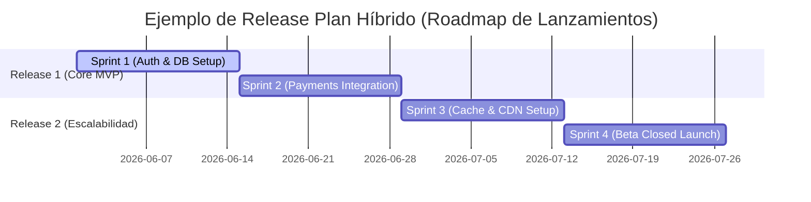

# Gestión del Cronograma y Planificación del Tiempo en Proyectos Ágiles

> [!NOTE]
> **Enfoque de Ingeniería y Liderazgo Técnico (Big Tech Mindset)**  
> En Big Tech, las estimaciones temporales no se basan en diagramas de Gantt estáticos. La velocidad real de entrega se mide a través del rendimiento histórico del equipo (*velocity / throughput*) y se gestionan las dependencias externas de forma activa mediante el diseño de APIs estables y el desacoplamiento de servicios.

---

## Release Plan vs. Cronograma Tradicional

En los proyectos tradicionales, el cronograma es una línea de tiempo estricta que detalla las fechas de inicio y fin de cada tarea individual. En Agile, el equivalente es el **Plan de Lanzamiento (Release Plan)**.



* **Release Plan (Ágil):** Plan de alto nivel que abarca una serie de iteraciones (Sprints) para entregar un conjunto de funcionalidades valiosas.
* **Mecanismos de Compromiso:**
  * **Alcance Fijo / Tiempo Variable:** Se calcula la fecha de lanzamiento estimada basándose en que todo el backlog priorizado debe completarse.
  * **Tiempo Fijo / Alcance Variable (Recomendado):** Se fija la fecha de lanzamiento (ej. Fin del Q2) y se ajusta inductivamente la cantidad de funcionalidades (historias de usuario) que se lograrán desplegar en esa fecha basándose en la velocidad histórica del equipo.

---

## Relaciones de Precedencia y Dependencias Técnicas

Para secuenciar el trabajo de manera óptima, el Tech Lead debe identificar los tipos de dependencias e integrarlas en la planificación:

### 1. Tipos de Dependencias
* **Obligatorias (Lógicas/Físicas):** Inherentes a la naturaleza del trabajo técnico (ej. no se puede desplegar un endpoint de base de datos sin haber creado el esquema o modelo de datos).
* **Discrecionales (Preferidas/Buenas Prácticas):** Definidas por el equipo de ingeniería basándose en buenas prácticas (ej. escribir pruebas de integración después de codificar el endpoint, aunque técnicamente el código podría funcionar sin ellas).
* **Internas:** Dependencias bajo el control del propio equipo del proyecto (ej. que el frontend consuma una API del backend del mismo equipo).
* **Externas:** Dependencias fuera del control del equipo (ej. la aprobación de la cuenta de comerciante por parte de Stripe o la provisión de infraestructura cloud por el equipo central de DevOps corporativo).

### 2. Relaciones de Precedencia (Precedence Diagramming Method - PDM)

```text
  Finish-to-Start (FS)       Start-to-Start (SS)       Finish-to-Finish (FF)
     [Tarea A] (Fin)            [Tarea A] (Inicio)          [Tarea A] (Fin)
          │                          │                           │
          ▼                          ▼                           ▼
    [Tarea B] (Inicio)         [Tarea B] (Inicio)          [Tarea B] (Fin)
```

* **Finish-to-Start (FS):** La tarea B no puede iniciar hasta que finalice la tarea A (Relación más común).
* **Start-to-Start (SS):** La tarea B no puede iniciar hasta que inicie la tarea A (Útil para paralelizar tareas).
* **Finish-to-Finish (FF):** La tarea B no puede finalizar hasta que finalice la tarea A (Común en procesos de pruebas E2E en paralelo con el cierre de desarrollo).
* **Start-to-Finish (SF):** La tarea B no puede finalizar hasta que inicie la tarea A (Relación poco frecuente en software).

---

## Estimaciones: La Inversión Ágil de Recursos

En la gestión tradicional, primero se definen las actividades y luego se estiman los recursos (personas) necesarios para ejecutarlas. Agile invierte esta lógica:

* **Equipos Dedicados Fijos:** Los miembros del equipo (recursos) se asignan por adelantado de manera 100% dedicada y estable.
* **Beneficio de la Estabilidad:** Un equipo estable mejora drásticamente su eficiencia operativa y predecibilidad (*Velocity*), ya que los ingenieros aprenden a trabajar juntos como un organismo integrado (etapas de *Forming, Storming, Norming, Performing*).
* **Estimación Iterativa:** Es el equipo estable quien estima la duración de las características en cada Sprint Planning, y no un manager externo.

---

> [!TIP]
> **Pregunta de Entrevista de Big Tech (Engineering & Project Leadership)**  
> *Tu equipo de desarrollo tiene una velocidad constante de 30 puntos por Sprint. El Product Owner quiere comprometer una fecha de lanzamiento fija de aquí a 4 Sprints (120 puntos de alcance total). Sin embargo, el backlog actual de la release tiene 150 puntos de historia estimados y hay dependencias externas críticas de un equipo de plataforma que está saturado. ¿Cómo gestionarías este cronograma?*
> 
> **Respuesta Estratégica:**  
> 1. **Analizar la Capacidad Real frente al Compromiso:** Muestro de forma transparente los datos históricos: en 4 Sprints, el equipo entregará de forma predecible ~120 puntos de historia. Hay una brecha de 30 puntos (un Sprint completo de trabajo) para lograr los 150 puntos deseados.
> 2. **Desacoplar las Dependencias Externas:**
>    * Identifico cuáles de los 150 puntos de historia dependen directamente del equipo de plataforma externa.
>    * Negocio con el equipo de plataforma la definición de un contrato de API estable o un buffer intermedio (ej. Mocks), permitiendo a mi equipo avanzar de forma autónoma sin esperar a que su infraestructura esté lista.
> 3. **Priorizar mediante Costo de Oportunidad (Scope Cutting):** Colaboro con el PO para repriorizar el backlog y aplicar la regla del 100%. Identificamos las historias que suman 30 puntos de menor valor de negocio y las movemos fuera de la Release 1 (ej. pasándolas al Backlog general para la Release 2). Esto asegura que entreguemos un incremento 100% funcional y de alta calidad técnica en la fecha fija comprometida.
