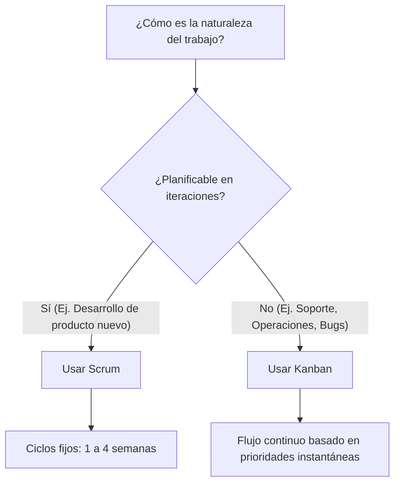

# Scrum y Kanban: Marcos de Trabajo Ágiles

En el desarrollo de software moderno, elegir el flujo de trabajo adecuado determina la velocidad de comercialización (time-to-market) y la salud de un equipo. Este documento detalla la gobernanza de Scrum y Kanban, y proporciona criterios objetivos para decidir qué flujo utilizar.

---

## Scrum: Roles y Responsabilidades

Scrum es un marco de trabajo iterativo enfocado en la entrega estructurada de valor. Su estructura organizativa se compone de tres roles principales:

1. **Product Owner (PO)**:
   * **Responsabilidad**: Maximizar el valor del producto resultante del trabajo del equipo.
   * **Actividades clave**: Gestión del Backlog de Producto, priorización de ítems alineados con la estrategia de negocio y clarificación de requisitos.
2. **Scrum Master (SM)**:
   * **Responsabilidad**: Promover y apoyar Scrum según la guía oficial. Asegurar la efectividad del equipo.
   * **Actividades clave**: Facilitar ceremonias, remover impedimentos organizacionales y técnicos, y guiar al equipo en autoorganización.
3. **Developers (Equipo de Desarrollo)**:
   * **Responsabilidad**: Crear cualquier aspecto de un incremento útil en cada Sprint.
   * **Actividades clave**: Autoorganizarse para definir el plan de ejecución técnica, mantener los estándares de calidad y completar el trabajo comprometido en el Sprint Backlog.

---

## Ceremonias de Scrum: Cadencia de Inspección y Adaptación

| Ceremonia | Frecuencia | Objetivo Principal | Participantes |
| :--- | :--- | :--- | :--- |
| **Sprint Planning** | Inicio de cada Sprint | Definir qué se puede entregar (Meta del Sprint) y cómo se realizará el trabajo. | Todo el equipo |
| **Daily Scrum** | Diaria (15 mins) | Inspeccionar el progreso hacia la Meta del Sprint y adaptar el Sprint Backlog si es necesario. | Developers (SM/PO opcionales) |
| **Sprint Review** | Fin de cada Sprint | Inspeccionar el incremento del Sprint y determinar futuras adaptaciones del Backlog con stakeholders. | Todo el equipo + Stakeholders |
| **Sprint Retrospective** | Fin de cada Sprint | Planificar formas de aumentar la calidad y la efectividad en procesos y dinámicas humanas. | Equipo Scrum |
| **Product Backlog Refinement** | Continua (Inter-sprint) | Desglosar, estimar y detallar ítems del backlog para futuros sprints. | PO + Developers |

---

## Kanban: Gestión Visual del Flujo

Kanban se centra en optimizar el flujo de valor a través de la visualización del trabajo y la limitación de la multitarea.

### Principios Fundamentales
* **Visualizar el flujo**: Usar un tablero Kanban con columnas claras que representen los estados reales del flujo de valor (ej. *Por hacer*, *En desarrollo*, *Revisión de Código*, *QA*, *Listo para producción*).
* **Limitar el WIP (Work in Progress)**: Establecer límites numéricos en cada columna intermedia para evitar cuellos de botella y maximizar el rendimiento real del equipo.
* **Gestionar el flujo**: Medir e inspeccionar constantemente la forma en que el trabajo se mueve a través del tablero.
* **Políticas explícitas**: Definir criterios claros de entrada y salida para cada columna (Definition of Done parciales o acuerdos de nivel de servicio).

---

## Cuándo usar Scrum vs. Kanban: Guía de Selección

### Tabla Comparativa de Criterios

| Criterio | Scrum | Kanban |
| :--- | :--- | :--- |
| **Ritmo de Entrega** | Iteraciones de tiempo fijo (Sprints de 1-4 semanas). | Entrega continua y según demanda (Continuous Delivery). |
| **Cambios durante el ciclo** | No se permiten cambios que afecten el objetivo del Sprint. | Se pueden añadir o repriorizar tareas en cualquier momento si hay capacidad de WIP. |
| **Métrica Principal** | Velocidad (puntos de historia por Sprint). | Lead Time, Cycle Time y rendimiento general. |
| **Roles predefinidos** | Sí (PO, SM, Developers). | No requiere roles específicos (respeta roles existentes). |
| **Enfoque** | Enfoque iterativo en metas y sprints de producto. | Enfoque continuo en reducir cuellos de botella y optimizar flujo. |
