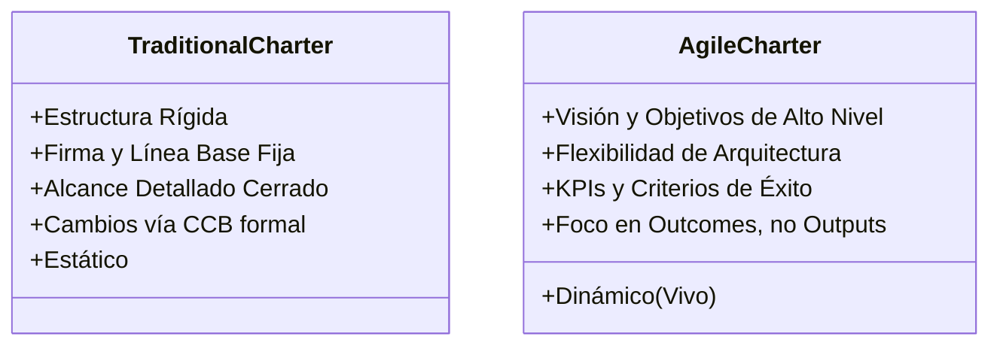

# Gestión de Integración en Entornos Ágiles e Híbridos

> [!NOTE]
> **Enfoque de Ingeniería y Liderazgo Técnico (Big Tech Mindset)**  
> En grandes organizaciones de tecnología, los proyectos raramente son 100% Scrum o 100% predictivos; suelen operar en modelos híbridos. La integración efectiva consiste en orquestar dependencias técnicas, coordinar flujos de trabajo de múltiples equipos (ej. SRE, Frontend, Seguridad) y tomar decisiones tácticas basadas en trade-offs claros de infraestructura y recursos.

---

## Project Charter: Dinámico vs. Estático

El **Project Charter (Acta de Constitución del Proyecto)** es el documento que formaliza la existencia del proyecto y otorga autoridad al Project Manager/Líder sobre los recursos.



* **Charter Tradicional (Estático):** Define el alcance exacto, cronograma rígido y costos fijos al inicio. Cualquier desviación posterior se considera un fallo de planificación y requiere aprobación formal del comité de control de cambios.
* **Charter Ágil (Dinámico / Vivo):** Se centra en la **Visión**, los **Objetivos de Negocio (Outcomes)** y las fronteras de tolerancia técnica/financiera. Se asume que el alcance detallado cambiará y se actualizará a lo largo del proyecto para incorporar nuevas tecnologías y retroalimentación del mercado.

---

## Project Management Plan en Enfoques Híbridos

El Plan de Dirección del Proyecto (*Project Management Plan*) en entornos puramente ágiles no se planifica de forma exhaustiva para todo el ciclo de vida del producto. En su lugar, se enfoca en planificar a detalle **la siguiente iteración** (Sprint). 

### La Estrategia Híbrida
En muchas empresas Big Tech se adopta un enfoque híbrido:
1. **Fase de Diseño de Sistemas y Arquitectura (Predictiva):** Definición de contratos de API, especificaciones técnicas de datos y requerimientos de cumplimiento y seguridad.
2. **Fase de Desarrollo y Despliegue (Adaptativa/Ágil):** Sprints iterativos para implementar historias de usuario en producción de forma continua.

---

## Gestión del Conocimiento: Tácito vs. Explícito

Un gran desafío en la gestión de integración es asegurar que el conocimiento no se quede estancado en silos individuales.

```text
┌─────────────────────────────────────────────────────────────────────────────┐
│                          Gestión del Conocimiento                           │
├──────────────────────────────────────┬──────────────────────────────────────┤
│ Conocimiento Explícito               │ Conocimiento Tácito                  │
├──────────────────────────────────────┼──────────────────────────────────────┤
│ • Fácil de codificar y registrar.    │ • Basado en experiencia y know-how.  │
│ • Ej: Diagramas de arquitectura, API  │ • Difícil de documentar en palabras. │
│   docs, código en Git, métricas.    │ • Ej: Intuición técnica, debugging.  │
└──────────────────────────────────────┴──────────────────────────────────────┘
```

* **Transferencia en Agile:** Agile prioriza la transferencia de **conocimiento tácito** mediante interacciones directas: programar en parejas (*pair programming*), dinámicas de *mob programming*, revisiones de código exhaustivas y sesiones de diseño colectivas.

---

## Control Integrado de Cambios en Agile

El control de cambios tradicional protege las líneas base originales mediante un flujo de aprobación formal (Change Control Board - CCB). En Agile, el cambio no se evita, sino que se abraza y se integra de forma nativa en el ciclo de vida del software:

* **Regla de la Iteración:** Los cambios solicitados **nunca** entran directamente en el Sprint actual (a menos que sea un fallo crítico del sistema).
* **Flujo de Entrada:** Cada solicitud de cambio se convierte en un ítem de backlog que ingresa al **Product Backlog**. El Product Owner evalúa su valor y lo prioriza para futuros Sprints.

---

> [!TIP]
> **Pregunta de Entrevista de Big Tech (System Design & Leadership)**  
> *Estamos integrando un sistema heredado (Legacy) predictivo controlado por otra división corporativa con nuestra nueva plataforma de microservicios ágil. La división Legacy exige definir todas las APIs con 6 meses de anticipación para su firma contractual, pero nuestro equipo necesita refinar el diseño de forma iterativa durante el desarrollo. ¿Cómo gestionas esta integración?*
> 
> **Respuesta Estratégica:**  
> 1. **Implementar un patrón Anti-Corrupción (Anti-Corruption Layer - ACL):** Técnicamente, creamos una capa de abstracción / adaptador intermedio (ACL) que aísle nuestro sistema moderno de las llamadas rígidas del sistema Legacy. Esto nos permite cambiar el diseño interno de nuestros servicios sin alterar el contrato expuesto.
> 2. **Definir Contratos Basados en Mocks Tempranos:** Acordamos una interfaz de API básica e inicial basada en OpenAPI/Swagger que actúe como contrato preliminar. Implementamos servidores de mocks automáticos para que el equipo Legacy pueda empezar a integrarse de inmediato, mientras nosotros desarrollamos de manera iterativa por detrás del ACL.
> 3. **Establecer Puntos de Sincronización Clave:** Definimos hitos de integración técnica (ej. Sprints de integración conjuntos cada 4 semanas) en lugar de esperar al final de los 6 meses, mitigando el riesgo de integración tarde en el proyecto.
