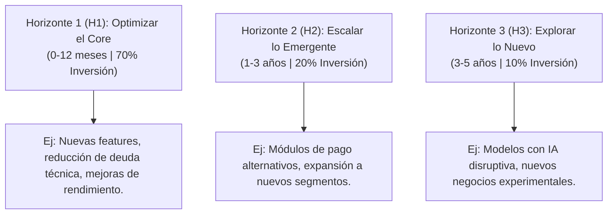

# Agile Portfolio Management

> [!NOTE]
> **Definición de Agile Portfolio Management (APM)**  
> Conjunto de prácticas para seleccionar, priorizar, financiar y supervisar iniciativas alineadas con la estrategia organizacional, aplicando principios ágiles para adaptarse al cambio de forma continua y maximizar la entrega de valor al cliente final.

---

## 1. Gestión Tradicional vs. Agile Portfolio Management

En el modelo tradicional, el portafolio se planifica anualmente bajo presupuestos fijos y alcances cerrados. En el enfoque ágil, el portafolio se revisa y ajusta de forma adaptativa.

| Dimensión | Gestión Tradicional | Agile Portfolio Management |
| :--- | :--- | :--- |
| **Planificación** | Anual, fija y rígida. | Continua, adaptativa y por ciclos cortos (sprints/PIs). |
| **Presupuesto** | Asignado por proyecto al inicio del año fiscal. | Financiamiento por flujo de valor (*Value Stream Funding*). |
| **Priorización** | Lista estática definida al inicio del año. | Dinámica, basada en valor, riesgo y urgencia (WSJF). |
| **Gobierno** | Control centralizado y reporte de micro-estado. | *Lean Governance*: empoderamiento y autonomía de equipos. |
| **Métricas** | Cumplimiento estricto de cronograma y costo. | Valor entregado, flujo de entrega, velocidad y OKRs. |
| **Respuesta al Cambio**| Cambios gestionados como excepciones y variaciones. | El cambio es esperado y bienvenido como fuente de valor. |

---

## 2. Principios Clave del Agile Portfolio

1. **Alineación Estratégica Continua (P1):** El portafolio se revisa periódicamente para asegurar que cada iniciativa aporta a los OKRs o KPIs organizacionales. Si una iniciativa pierde alineación, se detiene o pivota.
2. **Financiamiento por Flujo de Valor (P2):** En lugar de financiar proyectos individuales, se financia cada *value stream* (líneas de negocio o producto). Los equipos distribuyen y optimizan el presupuesto internamente según el backlog priorizado.
3. **Priorización Basada en Valor (P3):** Se emplean fórmulas y técnicas cuantitativas como WSJF (*Weighted Shortest Job First*) para priorizar iniciativas según valor de negocio, urgencia temporal, reducción de riesgos y tamaño del trabajo.
4. **Retroalimentación Rápida e Iterativa (P4):** Las revisiones del portafolio se realizan en ciclos cortos (típicamente cada 8 a 12 semanas, coincidiendo con el incremento de programa - *PI* en SAFe).
5. **Visibilidad en Tiempo Real (P5):** Uso de tableros Kanban de portafolio para rastrear iniciativas de forma transparente desde la concepción hasta el despliegue.
6. **Lean Governance (P6):** Descentralización en la toma de decisiones y eliminación de burocracias de aprobación excesivas mediante el uso de directrices estratégicas (*guardrails*).

---

## 3. Estructura del Portafolio: Los 3 Horizontes de Innovacion

Adaptación del modelo de McKinsey al contexto ágil para balancear el portafolio de inversiones y asegurar la sostenibilidad del negocio a corto, mediano y largo plazo.



---

## 4. Herramientas y Prácticas Comunes

### A. Kanban de Portafolio
Visualiza el flujo de todas las iniciativas desde la idea inicial hasta la entrega en producción, permitiendo establecer límites de trabajo en progreso (WIP) y evitar cuellos de botella organizacionales.

* **Backlog Estratégico:** Ideas propuestas alineadas a la estrategia (ej: Plataforma IA para soporte, App Wearables).
* **Análisis / Validación:** Evaluando viabilidad, MVP y cálculo de WSJF (ej: Módulo billetera digital).
* **En Desarrollo:** Equipos ejecutando los MVP / incrementos (ej: Rediseño de app móvil).
* **En Pruebas / Validación:** Fase de despliegue en entornos no-productivos y validación (ej: Dashboard analytics).
* **Entregado / Producción:** Generando valor en el mercado (ej: Onboarding digital, Login biométrico).

### B. WSJF (Weighted Shortest Job First)
Fórmula utilizada para priorizar iniciativas dando precedencia al trabajo de mayor impacto y urgencia que se puede entregar con menor esfuerzo.

$$\text{WSJF} = \frac{\text{Valor para el Negocio} + \text{Urgencia Temporal} + \text{Reducción de Riesgo o Habilitación de Oportunidades}}{\text{Tamaño del Trabajo (Esfuerzo)}}$$

#### Tabla de Ejemplo Práctico de Priorización WSJF

| Iniciativa | Valor Negocio | Urgencia | Reducción Riesgo / Oport. | Cost of Delay (CoD) | Tamaño (Esfuerzo) | **WSJF** | Prioridad |
| :--- | :---: | :---: | :---: | :---: | :---: | :---: | :---: |
| **Optimizar DB Legacy** | 3 | 5 | 8 | 16 | 2 | **8.00** | **1°** |
| **Integración IA Support** | 5 | 8 | 8 | 21 | 5 | **4.20** | **2°** |
| **Dashboard Analytics** | 5 | 3 | 2 | 10 | 3 | **3.33** | **3°** |
| **Módulo Open Banking** | 8 | 8 | 5 | 21 | 8 | **2.63** | **4°** |
| **Rediseño App Móvil** | 8 | 5 | 3 | 16 | 13 | **1.23** | **5°** |

> [!TIP]
> **Lección de WSJF**  
> *"Optimizar DB Legacy"* tiene un valor de negocio relativamente bajo (3), pero ofrece una alta reducción de riesgo (8) y es muy pequeño (2). Esto le otorga la máxima prioridad de ejecución.

### C. OKRs como Marco de Alineación
Los *Objectives and Key Results* (OKRs) conectan la estrategia del portafolio con la ejecución diaria de los equipos.
* **Objetivo (Empresa):** Ser la plataforma fintech #1 en el segmento joven peruano (18-30 años) en 2026.
  * **KR 1:** Alcanzar 2 millones de usuarios activos mensuales (MAU).
    * *Iniciativa:* Campaña de adquisición digital y programa de referidos.
  * **KR 2:** Obtener un Net Promoter Score (NPS) $\ge 60$ en la app móvil.
    * *Iniciativa:* Rediseño UX y simplificación del flujo de onboarding.
  * **KR 3:** Reducir el tiempo de aprobación de créditos a menos de 3 minutos.
    * *Iniciativa:* Automatización con Machine Learning y consumo directo de APIs crediticias.

---

## 5. Marcos de Planificacion: PI Planning (SAFe)

El *Program Increment (PI) Planning* es un evento periódico presencial o distribuido de 2 días donde todos los equipos del portafolio se alínean para planificar el incremento del programa para las próximas 8 a 12 semanas.

```text
|                                  Program Increment (PI): 8-12 semanas                                  |
|---------------------------------------------------------------------------------------------------------|
|  PI Planning (2 días)  |  Sprint 1 (2 sem)  |  Sprint 2 (2 sem)  |  Sprint 3 (2 sem)  |  IP Sprint (2 sem) |
```

* **Día 1 - AM:** Visión del negocio por el Product Management y contexto de la arquitectura técnica por los System Architects.
* **Día 1 - PM:** Los equipos planifican sus sprints individuales, identifican dependencias transversales en el *Program Board* y establecen sus *PI Objectives*.
* **Día 2 - AM:** Presentación de los planes por equipo y categorización de riesgos mediante el método **ROAM**:
  * **R**esolved (Resuelto): El riesgo ya no es un problema.
  * **O**wned (Asignado): Alguien se hace responsable de mitigar el riesgo.
  * **A**ccepted (Aceptado): Se asume el riesgo dado que no puede modificarse.
  * **M**itigated (Mitigado): Se implementa una acción para disminuir su probabilidad de impacto.
* **Día 2 - PM:** Voto de confianza del tren (escala de 1 a 5 dedos), ajustes finales del plan y retrospectiva del evento de planificación.

---

## 6. Evolución del Gobierno: De la PMO Tradicional a la Agile PMO

El rol de la PMO (Project Management Office) pasa de ser una entidad de control a convertirse en un facilitador estratégico (EPMO - Enterprise PMO).

| Eje de Comparación | PMO Tradicional | Agile PMO |
| :--- | :--- | :--- |
| **Rol Principal** | Controlador, auditor y guardabarrera del proceso. | Coach, facilitador de cambio y *Servant Leader*. |
| **Función** | Aprobar fases, auditar desviaciones y reportar estados. | Habilitar equipos, eliminar dependencias y fomentar el flujo. |
| **Métrica Clave** | % de cumplimiento de alcance, cronograma y costos (hierro). | Valor de negocio entregado y métricas de flujo. |
| **Talento Requerido** | Project Managers orientados a certificaciones de control. | Agile Coaches, Release Train Engineers (RTE), Product Owners. |
| **Frecuencia de Feedback** | Reportes semanales/mensuales de avance estático. | Métricas en tiempo real, tableros interactivos y revisiones de PI. |

---

## 7. Casos de Estudio Reales

### A. Spotify: Estructura de Squads y Tribus
Spotify desarrolló un framework centrado en la autonomía de los equipos alineados a una estrategia de portafolio clara:
* **Squad:** Célula autónoma de 6 a 12 personas con una misión (ej: mejorar el buscador). Tiene su propio backlog, PO y capacidad de delivery de principio a fin.
* **Tribe (Tribu):** Agrupación de Squads que trabajan en áreas funcionales relacionadas (máximo ~150 personas).
* **Chapter:** Grupo transversal de personas con el mismo rol (ej: desarrolladores backend) para compartir mejores prácticas técnicas.
* **Guild (Gremio):** Comunidad de interés abierta para toda la organización (ej: entusiastas de la accesibilidad o IA).

### B. ING Bank: Reorganización Integral
En 2015, ING Amsterdam disolvió sus departamentos jerárquicos de IT, marketing y finanzas.
* Reorganizó toda la empresa en Squads y Tribus con presupuestos permanentes por flujo de valor.
* **Resultados:** Reducción del time-to-market de 3 meses a 2 semanas, reducción de 30M USD en costos operativos y aumento del NPS en 30 puntos en los primeros dos años.

### C. Amazon: Two-Pizza Teams y Conway's Law
* **Regla del Two-Pizza Team:** Los equipos deben ser lo suficientemente pequeños como para alimentarse con dos pizzas (4-8 personas).
* **Alineación Técnica:** La arquitectura orientada a microservicios permite que cada equipo actúe como dueño independiente de su servicio (ej: S3, Lambda). El portafolio de servicios se despliega sin necesidad de coordinaciones centralizadas excesivas.

---

## 8. Métricas de Gestión en el Portafolio Ágil

En APM no se mide el consumo de horas, sino la generación de valor y la salud del flujo de entrega.

### Métricas de Valor
* **Business Value (BV):** Porcentaje de valor de negocio entregado en el PI frente a lo planificado inicialmente.
* **OKR Achievement Rate:** Nivel de cumplimiento de los resultados clave trimestrales. Meta óptima: 70-75% (un 100% constante indica objetivos poco ambiciosos).

### Métricas de Flujo
* **Throughput:** Cantidad de iniciativas completadas exitosamente en el período (ej: iniciativas por trimestre).
* **Cycle Time:** Tiempo promedio desde que una iniciativa inicia desarrollo hasta su despliegue en producción.
* **Eficiencia del Flujo (Flow Efficiency):** Relación entre el tiempo de trabajo activo y el tiempo total de ciclo (esperas incluidas). Un portafolio ágil óptimo debe estar por encima del 40%.

### Métricas de Calidad
* **Defect Escape Rate:** Porcentaje de bugs encontrados en producción en relación al total del incremento (Meta: $< 5\%$).
* **Technical Debt Ratio:** Proporción de inversión dedicada a corregir la deuda técnica del sistema (un porcentaje mayor al 30% indica degradación futura del flujo).

---

## 9. Barreras y Desafíos para su Implementación

1. **Resistencia Cultural:** Mandos medios que temen perder el control jerárquico o la visibilidad de los flujos de información.
2. **Ciclos de Presupuesto Anuales:** Rigidez por parte de áreas de finanzas que no comprenden el financiamiento adaptativo por *value streams*.
3. **Ausencia de Liderazgo Ágil:** Direcciones ejecutivas que promueven marcos ágiles abajo pero continúan gestionando de forma tradicional (*top-down*).
4. **Silos Funcionales:** Dependencias con áreas tradicionales de la organización (legal, compras, seguridad) que no operan bajo flujos continuos.

---

## Referencias y Recursos
* **Scaled Agile Framework (SAFe 6.0):** scaledagileframework.com - Sección *Lean Portfolio Management*.
* *Lean Portfolio Management* – Alex Yakyma (SAFe Series, 2021).
* *Accelerate: The Science of Lean Software and DevOps* – Nicole Forsgren, Jez Humble & Gene Kim (2018).
* *Team Topologies* – Manuel Pais & Matthew Skelton (2019).
