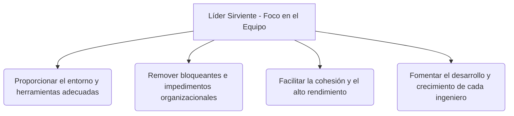

# Gestión de Recursos y Liderazgo de Equipos en Proyectos Ágiles

> [!NOTE]
> **Enfoque de Ingeniería y Liderazgo Técnico (Big Tech Mindset)**  
> En Big Tech, el antipatrón más costoso es el fraccionamiento de tiempo de los ingenieros en múltiples proyectos paralelos (*context switching*). Un líder técnico efectivo defiende la dedicación exclusiva de las células de desarrollo, fomenta la autoorganización y actúa como un facilitador que elimina los obstáculos del camino del equipo (*servant leadership*).

---

## Equipos Multifuncionales y Dedicados vs. Fraccionados (Time-Fractioned)

La asignación de ingenieros a múltiples proyectos simultáneos degrada la productividad neta debido al costo cognitivo del cambio de contexto (*context switching*).

```text
  TRADICIONAL (Fraccionado):
  Ingeniero A ──> 30% Proyecto 1  ──> 40% Proyecto 2  ──> 30% Soporte Legacy
  * Alto desperdicio de tiempo por cambio de contexto y reuniones duplicadas.

  ÁGIL (Equipo Multifuncional y Dedicado):
  [Célula / Pod Dedicado] ──> Foco del 100% en un único Producto/Backlog
  (Incluye Backend, Frontend, QA, Diseñador y Product Owner integrados)
```

### Características de las Células de Desarrollo Ágiles (Pods)
* **Multifuncionalidad (Cross-functionality):** El equipo tiene todas las habilidades necesarias para llevar una idea desde el concepto hasta el despliegue en producción (código funcionando) sin depender de aprobaciones de equipos externos.
* **Autoorganización:** El equipo es autónomo y responsable de decidir **cómo** resolver los problemas técnicos y estimar su propia capacidad de trabajo.
* **Co-localización:** Fomentar el trabajo en el mismo espacio (físico o virtual mediante canales de comunicación inmediata) para maximizar la transferencia de conocimiento tácito.

---

## El Rol del Project Manager / Tech Lead como Líder Sirviente

En Agile, el líder abandona el rol clásico de comando y control (asignación y supervisión directa de tareas) y asume la filosofía de **Líder Sirviente (Servant Leader)**:



---

## Los 5 Valores de Scrum

Los marcos de trabajo ágiles se sostienen sobre valores culturales que guían el comportamiento colectivo:

1. **Compromiso (Commitment):** El equipo se compromete a alcanzar las metas del Sprint y a apoyarse mutuamente en el proceso.
2. **Coraje (Courage):** Tener la valentía de hacer lo correcto, afrontar problemas técnicos complejos y decir "no" cuando los requerimientos comprometen la calidad.
3. **Enfoque (Focus):** Concentrarse en el trabajo del Sprint y limitar el WIP para entregar valor real de forma fluida.
4. **Apertura (Openness):** Transparencia total sobre el estado del proyecto, los riesgos y los fallos cometidos para aprender colectivamente.
5. **Respeto (Respect):** Valorar la capacidad y la autonomía de cada miembro del equipo, reconociendo que cada uno aporta desde su experiencia multifuncional.

---

> [!TIP]
> **Pregunta de Entrevista de Big Tech (Technical Leadership & People Management)**  
> *Tenemos un Tech Lead muy talentoso que escribe el 50% de las características del Sprint, pero toma todas las decisiones de arquitectura de manera unilateral, asigna las tareas directamente a los ingenieros junior y no fomenta el debate técnico en las dailies. ¿Cómo abordarías esta situación como Engineering Manager?*
> 
> **Respuesta Estratégica:**  
> 1. **Identificar el Antipatrón (El "Héroe" o Silo de Conocimiento):** Reconozco que, aunque el Tech Lead produce mucho código, su estilo de liderazgo está sofocando la autoorganización del equipo, creando dependencias críticas en su persona y bloqueando el desarrollo de los ingenieros junior.
> 2. **Conversación 1-on-1 de Feedback:** Me reúno con el Tech Lead para cambiar su perspectiva sobre el éxito:
>    * Su métrica de éxito ya no es cuánto código escribe individualmente (*output*), sino **el impacto y el crecimiento técnico del equipo a su cargo** (*outcome*).
>    * Le propongo actuar como un líder sirviente y mentor.
> 3. **Acciones Concretas para Fomentar la Autoorganización:**
>    * *Pair Programming* obligatorio del Tech Lead con los juniors en los componentes más complejos para transferir el conocimiento tácito.
>    * Delegar el diseño de pequeñas arquitecturas a los juniors, actuando el Tech Lead únicamente como revisor (*facilitador*).
>    * Fomentar que en las reuniones de planificación y Daily el equipo decida la asignación de tareas de forma colectiva y visual en el tablero Kanban.
