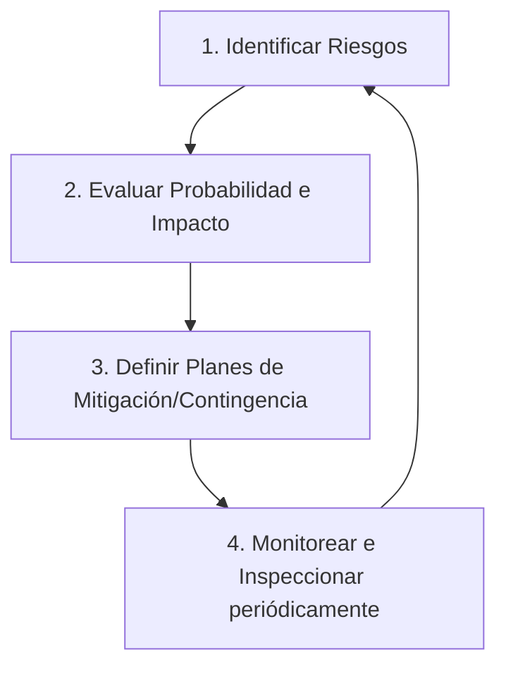

# Gestión de Riesgos y Mitigación de Fallas

Un proyecto exitoso no es aquel que no experimenta problemas, sino el que planifica cómo responder a ellos antes de que ocurran. Este documento provee una metodología estructurada para identificar, analizar y mitigar riesgos en proyectos de desarrollo de software.

---

## Matriz de Probabilidad e Impacto

Para priorizar los riesgos, utilizamos un sistema de puntuación que evalúa la **Probabilidad** de ocurrencia y el **Impacto** en el proyecto (ambos en escala del 1 al 5).

$$\text{Puntuación de Riesgo (Score)} = \text{Probabilidad} \times \text{Impacto}$$

### Criterios de Severidad:
* **Crítico (15 - 25)**: Requiere mitigación inmediata y monitoreo continuo por parte del Project Manager y patrocinadores.
* **Moderado (8 - 12)**: Debe mitigarse y monitorearse periódicamente en reuniones de estado.
* **Bajo (1 - 6)**: Riesgos aceptados; se registran y revisan si hay variaciones en el proyecto.

---

## Registro y Plan de Respuesta a Riesgos

A continuación se muestra un ejemplo de registro de riesgos típicos en el ciclo de vida del software con sus respectivos planes de mitigación y contingencia.

| ID | Descripción del Riesgo | Prob. (1-5) | Imp. (1-5) | Score | Estrategia de Mitigación (Preventiva) | Plan de Contingencia (Correctivo) |
| :--- | :--- | :---: | :---: | :---: | :--- | :--- |
| **R01** | **Retraso en la API de integración de pagos externa** (Proveedores terceros). | 4 | 4 | **16** | Iniciar integración temprana con sandboxes simulados (*mocks*) creados por el propio equipo técnico. | Ajustar el alcance del sprint para lanzar una versión beta con pago manual y posponer los flujos automatizados de Stripe. |
| **R02** | **Rotación de personal clave** (Salida repentina del arquitecto de software). | 2 | 5 | **10** | Documentar decisiones de arquitectura en documentos ADR (Architecture Decision Records) y fomentar la rotación de pares en el código. | Ejecutar un plan de transición express de 2 semanas financiado por el fondo de reserva del proyecto; mentoría cruzada. |
| **R03** | **Defectos de calidad críticos en producción** (Caída del servicio tras despliegue). | 3 | 4 | **12** | Implementar pruebas unitarias automáticas en el pipeline de CI/CD con umbral mínimo de cobertura de 80%. | Ejecutar Rollback automatizado en la consola de la nube (ej. Blue-Green Deployment) al estado estable anterior. |
| **R04** | **Corrupción del alcance (Scope Creep)** (Peticiones constantes de funcionalidades nuevas no presupuestadas). | 4 | 3 | **12** | Firmar un acuerdo de control de cambios claro en la gobernanza inicial. Todo cambio se evalúa en costo y tiempo antes de ser aceptado. | Negociar con el cliente el intercambio de funcionalidades equivalentes en puntos de historia para mantener la fecha del lanzamiento invariable. |

---

## Ciclo de Gestión de Riesgos

