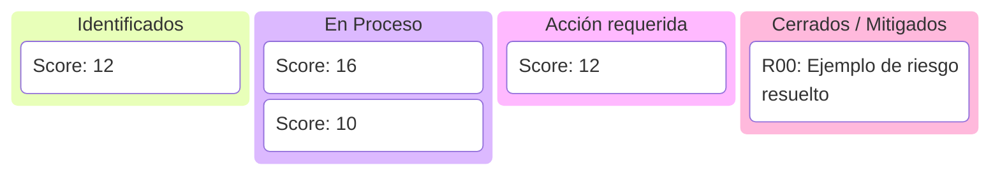

# Gestión de Riesgos y Mitigación de Fallas

Un proyecto exitoso no es aquel que no experimenta problemas, sino el que planifica cómo responder a ellos antes de que ocurran. Este documento provee una metodología estructurada para identificar, analizar y mitigar riesgos en proyectos de desarrollo de software.

---

## Matriz de Probabilidad e Impacto

Para priorizar los riesgos, utilizamos un sistema de puntuación que evalúa la **Probabilidad** de ocurrencia y el **Impacto** en el proyecto (ambos en escala del 1 al 5).

$$\text{Puntuación de Riesgo (Score)} = \text{Probabilidad} \times \text{Impacto}$$

### Criterios de Severidad:
* **Crítico (15 - 25)**: Requiere mitigación inmediata y monitoreo continuo por parte del Project Manager y patrocinadores.
* **Moderado (8 - 12)**: Debe mitigarse y monitorearse periódicamente en reuniones de estado.
* **Bajo (1 - 6)**: Riesgos aceptados; se registran y revisan si hay variaciones en el proyecto.

---

## Registro y Plan de Respuesta a Riesgos

A continuación se muestra un ejemplo de registro de riesgos típicos en el ciclo de vida del software con sus respectivos planes de mitigación y contingencia.

| ID | Descripción del Riesgo | Prob. (1-5) | Imp. (1-5) | Score | Estrategia de Mitigación (Preventiva) | Plan de Contingencia (Correctivo) |
| :--- | :--- | :---: | :---: | :---: | :--- | :--- |
| **R01** | **Retraso en la API de integración de pagos externa** (Proveedores terceros). | 4 | 4 | **16** | Iniciar integración temprana con sandboxes simulados (*mocks*) creados por el propio equipo técnico. | Ajustar el alcance del sprint para lanzar una versión beta con pago manual y posponer los flujos automatizados de Stripe. |
| **R02** | **Rotación de personal clave** (Salida repentina del arquitecto de software). | 2 | 5 | **10** | Documentar decisiones de arquitectura en documentos ADR (Architecture Decision Records) y fomentar la rotación de pares en el código. | Ejecutar un plan de transición express de 2 semanas financiado por el fondo de reserva del proyecto; mentoría cruzada. |
| **R03** | **Defectos de calidad críticos en producción** (Caída del servicio tras despliegue). | 3 | 4 | **12** | Implementar pruebas unitarias automáticas en el pipeline de CI/CD con umbral mínimo de cobertura de 80%. | Ejecutar Rollback automatizado en la consola de la nube (ej. Blue-Green Deployment) al estado estable anterior. |
| **R04** | **Corrupción del alcance (Scope Creep)** (Peticiones constantes de funcionalidades nuevas no presupuestadas). | 4 | 3 | **12** | Firmar un acuerdo de control de cambios claro en la gobernanza inicial. Todo cambio se evalúa en costo y tiempo antes de ser aceptado. | Negociar con el cliente el intercambio de funcionalidades equivalentes en puntos de historia para mantener la fecha del lanzamiento invariable. |

---

<<<<<<< HEAD
## Ciclo de Gestión de Riesgos (Enfoque Híbrido/Ágil)
=======
## Tablero de Control de Riesgos (Risk Board)

El **Risk Board** es la herramienta visual (inspirada en tableros Kanban) que utilizamos en el día a día para monitorear y gestionar los riesgos registrados de forma transparente y colaborativa.

### Estructura del Tablero (ROAM Modificado):

Las tarjetas de riesgo se clasifican por columnas según su estado actual de gestión:



* **Identificados**: Riesgos nuevos que han sido evaluados mediante la *Matriz de Probabilidad e Impacto* y están pendientes de asignación de propietario o inicio de plan de mitigación.
* **Mitigándose (En Proceso)**: Riesgos donde el plan preventivo de mitigación está activo.
* **Materializados (Acción Requerida)**: Riesgos que han ocurrido y requieren la ejecución inmediata del *Plan de Contingencia (Correctivo)*.
* **Cerrados / Mitigados**: Riesgos que ya no representan una amenaza (ej. la fase de integración ya concluyó o el proveedor ya entregó).

> [!TIP]
> **Codificación por Colores en el Tablero:**
> Utiliza etiquetas de color (*labels*) en el tablero visual para denotar la severidad obtenida en la matriz: **Rojo** para Críticos (Score 15-25), **Amarillo** para Moderados (Score 8-12) y **Verde** para Bajos (Score 1-6).

---

## Ciclo de Gestión de Riesgos
>>>>>>> 7e643b1f517574f1bb3a9c287bce8da9ff26f625

```mermaid
graph TD
    A[1. Identificar Riesgos] --> B[2. Evaluar Probabilidad e Impacto]
    B --> C[3. Definir Planes de Mitigación/Contingencia]
<<<<<<< HEAD
    C --> D[4. Integrar en Planificación de Iteración / Release]
    D --> E[5. Monitorear en Daily / Retrospectiva]
    E --> A
```

---

## Particularidades de la Gestión de Riesgos Ágil

A diferencia del enfoque predictivo (donde el Project Manager es el principal responsable de mantener un registro formal de riesgos), en entornos ágiles la gestión de riesgos se aborda bajo principios colectivos y empíricos:

### 1. Responsabilidad Compartida
La identificación y mitigación no recae de forma exclusiva en un rol directivo. Todo el equipo (Product Owner, Scrum Master, desarrolladores y stakeholders) participa activamente en la detección y resolución de riesgos durante las ceremonias del proyecto.

### 2. Gestión Acotada a la Iteración (Sprint-Level Constraints)
Dado que los proyectos ágiles operan en ciclos cortos (normalmente de 2 a 4 semanas), el equipo no intenta anticipar riesgos a muy largo plazo de forma predictiva. En su lugar, el esfuerzo de análisis y mitigación se centra principalmente en el horizonte temporal de la iteración actual o el próximo release.

### 3. Análisis Cualitativo sobre el Cuantitativo
Mientras que los proyectos tradicionales recurren a análisis cuantitativos complejos (como simulaciones Montecarlo o cálculo del valor monetario esperado), el enfoque ágil prioriza el **análisis cualitativo**. El equipo confía en el juicio colectivo, la intuición técnica y la experiencia acumulada para evaluar rápidamente la severidad del riesgo y definir acciones de inmediato.

---

## Estructura de Desglose de Riesgos (RBS - Risk Breakdown Structure)

Para categorizar y estructurar los posibles riesgos en proyectos de TI/Software, se utiliza la **RBS**, un gráfico jerárquico que desglosa los riesgos desde categorías de alto nivel hasta subniveles técnicos y organizacionales:

```mermaid
graph TD
    RBS["Riesgos del Proyecto (IT Project)"]
    
    %% Nivel 1
    RBS --> Business["Negocio (Business)"]
    RBS --> Technical["Técnico (Technical)"]
    RBS --> Org["Organizacional (Organizational)"]
    RBS --> PM["Gestión de Proyectos (Project Management)"]
    
    %% Nivel 2 - Negocio
    Business --> Competitors["Competencia / Mercado"]
    Business --> Suppliers["Proveedores / Terceros"]
    Business --> CashFlow["Flujo de Caja / Presupuesto"]
    
    %% Nivel 2 - Técnico
    Technical --> Hardware["Infraestructura / Hardware"]
    Technical --> Software["Deuda Técnica / Software"]
    Technical --> Network["Conectividad / Redes"]
    
    %% Nivel 2 - Organizacional
    Org --> ExecSupport["Apoyo Ejecutivo / Sponsor"]
    Org --> UserSupport["Soporte al Usuario"]
    Org --> TeamSupport["Soporte y Cultura de Equipo"]
    
    %% Nivel 2 - Gestión
    PM --> Estimates["Estimaciones de Esfuerzo"]
    PM --> Comm["Comunicación / Alineación"]
    PM --> Resources["Capacidad de Recursos"]
```



---

## El Tablero de Riesgos (Risk Board)

Para mantener los riesgos visibles y actualizados de manera transparente, los equipos ágiles utilizan un **radiador de información** llamado **Risk Board**. Este tablero categoriza el estado de los riesgos y las acciones tomadas para resolverlos:

| Estado / Obstáculo | Acción de Mitigación / Estrategia | Descripción del Enfoque |
| :--- | :--- | :--- |
| **Obstacles / Issues** | **Mitigate (Mitigar)** | Acciones preventivas para reducir la probabilidad o el impacto del riesgo. |
| | **Avoid (Evitar)** | Modificar el plan de desarrollo para eliminar la amenaza por completo. |
| | **Share (Compartir)** | Transferir la responsabilidad o la ejecución a un tercero especialista. |
| | **Accept (Aceptar)** | Reconocer el riesgo sin tomar medidas activas hasta que ocurra (se acepta el impacto). |
| | **Contingent (Contingencia)** | Plan de acción que solo se activa si el riesgo se materializa. |

> [!TIP]
> **Práctica Recomendada en Sprints:**  
> Durante la *Sprint Planning*, el equipo debe reservar un espacio para identificar bloqueantes y riesgos potenciales de las historias seleccionadas. Si un riesgo es demasiado alto, su mitigación se traduce en tareas específicas añadidas directamente al *Sprint Backlog*, asegurando que el riesgo se gestione de manera proactiva e integrada en el flujo de trabajo diario.

=======
    C --> D[4. Incorporar y Monitorear en el Risk Board]
    D --> A
```

>>>>>>> 7e643b1f517574f1bb3a9c287bce8da9ff26f625
