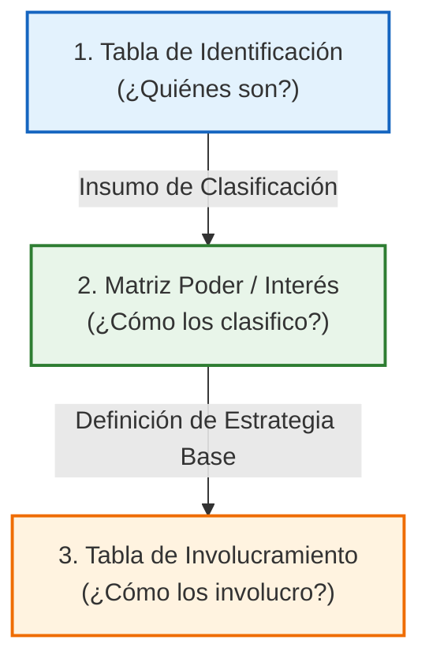
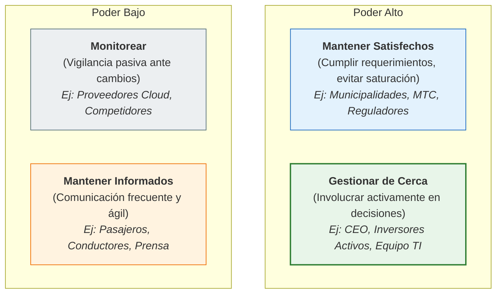

# Gestión de Interesados (Stakeholders) y Comunicación

La comunicación efectiva es el pegamento de los proyectos. Mantener a los interesados informados con el nivel adecuado de detalle evita malentendidos y garantiza el apoyo continuo al proyecto.

---

## Base Teórica: Gestión de Interesados

El éxito de un proyecto depende de involucrar a los interesados de manera efectiva, definiendo esto como: *"Identificar, analizar e involucrar activamente a los interesados a lo largo de todo el ciclo de vida del proyecto"*. Este proceso se rige por tres principios fundamentales:

1. **Iterativo**: La identificación no es un evento único de inicio. Se actualiza constantemente en cada fase o Sprint del proyecto.
2. **Proactivo**: No esperar a que los interesados reaccionen o surjan conflictos. Se debe interactuar con ellos antes de que ocurran desviaciones.
3. **Diferenciado**: Cada stakeholder tiene un perfil único y expectativas distintas. La estrategia de comunicación y colaboración debe adaptarse según su nivel de poder e interés.

---

## El Framework de los Tres Instrumentos

Para operativizar la gestión de interesados, el playbook implementa un framework conectado de tres herramientas secuenciales:

### 1. Tabla de Identificación de Stakeholders

Instrumento inicial que identifica y documenta a los individuos, grupos u organizaciones que pueden afectar o verse afectados por el proyecto.

* **N°**: Número correlativo para trazabilidad en otros documentos del proyecto.
* **Stakeholder**: Nombre o denominación del actor (persona, área, empresa externa).
* **Tipo**: Interno o Externo. Determina los canales de comunicación y políticas de seguridad aplicables.
* **Rol**: Función que desempeña (sponsor, desarrollador, usuario final, regulador, etc.).
* **Expectativas Principales**: Qué espera obtener o evitar con el proyecto. Es el insumo base para diseñar la estrategia.

#### Caso de Estudio: Uber (Expansión LATAM) - Identificación
| N° | Stakeholder | Tipo | Rol en el Proyecto | Expectativas Principales |
| :---: | :--- | :---: | :--- | :--- |
| **1** | CEO / Directorio Global | Interno | Sponsor Ejecutivo | Crecimiento de mercado, rentabilidad, cumplimiento regulatorio en cada ciudad. |
| **2** | Equipo de Tecnología (App) | Interno | Desarrollo y Soporte | Backlog claro, tiempo adecuado de sprint, arquitectura de microservicios escalable. |
| **3** | Conductores (Drivers) | Externo | Prestadores de Servicio | Tarifas justas, flexibilidad horaria, soporte ágil ante incidentes de seguridad. |
| **4** | Municipalidades / MTC | Externo | Ente Regulador | Cumplimiento de normativas de transporte, pago de impuestos, seguridad de pasajeros. |
| **5** | Pasajeros (Usuarios finales) | Externo | Clientes del Servicio | Seguridad, precio competitivo, disponibilidad alta, excelente usabilidad de la app. |
| **6** | Inversores Institucionales | Externo | Fuente de Capital / Control | ROI (retorno de inversión), eficiencia de capital, crecimiento de usuarios activos mensuales. |

---

### 2. Matriz de Poder / Interés

Clasificación estratégica bidimensional que mapea el nivel de **Poder** (capacidad de influir en el proyecto) frente al nivel de **Interés** (grado de afectación por los resultados).

* **Gestionar de Cerca (Alto Poder / Alto Interés)**: Son los actores clave. Requieren participación activa en decisiones críticas del proyecto.
* **Mantener Satisfechos (Alto Poder / Bajo Interés)**: Tienen la capacidad de bloquear o desviar el proyecto si se sienten ignorados. Requieren cumplimiento riguroso de gobernanza.
* **Mantener Informados (Bajo Poder / Alto Interés)**: Les importa de cerca el resultado pero no tienen poder formal. Requieren comunicación frecuente sobre avances y mejoras.
* **Monitorear (Bajo Poder / Bajo Interés)**: Tienen impacto limitado. Se realiza seguimiento pasivo y vigilancia ante posibles cambios de posición.

#### Clasificación del Caso de Estudio: Uber (Expansión LATAM)
* **Gestionar de Cerca**: CEO / Directorio Global, Inversores institucionales (activos), Equipo de Tecnología.
* **Mantener Satisfechos**: Municipalidades y MTC, Reguladores de datos personales, Ministerio de Transportes.
* **Mantener Informados**: Conductores, Pasajeros, Prensa y medios digitales.
* **Monitorear**: Proveedores cloud (AWS, Google), Competidores indirectos (DiDi, Cabify).

---

### 3. Tabla de Estrategias de Involucramiento

Instrumento final que define el plan de acción táctico: nivel de participación deseado, acciones concretas y KPIs de éxito.

* **Nivel de Involucramiento**: Escala del estado actual y deseado de los interesados:
  `Desconoce` $\rightarrow$ `Resistente` $\rightarrow$ `Neutral` $\rightarrow$ `Promotor` $\rightarrow$ `Líder`.
* **Estrategia Propuesta**: Acciones específicas como reuniones, artefactos ágiles, canales oficiales y métricas de control (KPIs).

> [!IMPORTANT]
> **Gobernanza Ágil**: En entornos ágiles, estas estrategias de involucramiento no son estáticas. Se revisan obligatoriamente en cada **Sprint Retrospective**. El nivel de involucramiento de cada stakeholder puede cambiar de manera dinámica con cada incremento entregado.

#### Caso de Estudio: Uber (Expansión LATAM) - Involucramiento
| Stakeholder | Cuadrante en Matriz | Nivel de Involucramiento (Actual / Deseado) | Estrategia Propuesta | KPI de Éxito / Canal |
| :--- | :--- | :---: | :--- | :--- |
| **CEO / Directorio** | Alto Poder / Alto Interés | `Neutral` $\rightarrow$ `Promotor` | Sesiones mensuales de Steering Committee y tableros automatizados de OKRs. | OKR Dashboard semanal |
| **Conductores** | Bajo Poder / Alto Interés | `Resistente` $\rightarrow$ `Neutral` | Mesas de diálogo bi-sprint, foro de feedback abierto y soporte in-app simplificado. | Nivel de satisfacción en encuestas |
| **Municipalidades** | Alto Poder / Bajo Interés | `Neutral` $\rightarrow$ `Neutral` | Comité de cumplimiento trimestral y canal de atención directa con área legal. | Reporte de incidentes e impuestos |
| **Pasajeros** | Bajo Poder / Alto Interés | `Promotor` $\rightarrow$ `Promotor` | Encuestas de satisfacción en la app, programa de referidos y pruebas beta de usabilidad. | Puntuación de NPS (Net Promoter Score) |
| **Inversores** | Alto Poder / Alto Interés | `Escéptico` $\rightarrow$ `Promotor` | Eventos semestrales de Investor Day y reportes trimestrales financieros detallados. | ROI y crecimiento mensual de usuarios activos |

---

## Plan de Comunicación del Proyecto

| Canal / Reunión | Frecuencia | Audiencia | Objetivo | Formato |
| :--- | :--- | :--- | :--- | :--- |
| **Comité de Dirección (Steering Committee)** | Mensual | Sponsor, PM, Clientes clave | Reportar hitos de alto nivel, estado financiero e hitos del Roadmap. | Presentación ejecutiva (PDF) |
| **Reporte de Estado Semanal** | Semanal (Viernes) | Interesados de nivel medio y equipo | Visibilidad del avance del proyecto, riesgos bloqueantes y entregables inmediatos. | Correo electrónico / Documento resumido |
| **Sprint Review** | Fin de Sprint (cada 2 sem.) | Usuarios finales, PO, Desarrolladores | Demo en vivo de la funcionalidad útil completada en el Sprint para recibir feedback. | Sesión síncrona interactiva |

---

## Plantilla de Reporte de Estado Semanal (Weekly Status Report)

**Proyecto**: `[Nombre del Proyecto]`  
**Período**: `[DD/MM/AAAA - DD/MM/AAAA]`  
**Líder de Proyecto**: `[Nombre de PM]`  
**Estado General**: **Verde** / **Amarillo** / **Rojo**

---

### Resumen Ejecutivo
*Breve descripción de 2-3 líneas sobre el estado general del proyecto.*

### Hitos Alcanzados esta Semana
* **[Entregable 1]**: *Descripción del hito completado (ej. Despliegue de pasarela de pago en staging).*
* **[Entregable 2]**: *Descripción (ej. Aprobación del diseño UX por el Sponsor).*

### Tareas Planificadas para la Próxima Semana
* **[Entregable 3]**: *Meta de desarrollo.*
* **[Entregable 4]**: *Pruebas de carga e infraestructura.*

### Riesgos y Bloqueantes Activos
* **[Bloqueante 1]**: *Detalle del impedimento y quién es el responsable de resolverlo para no impactar la ruta crítica.*

---

## Particularidades de la Comunicación Ágil

En los entornos ágiles, la comunicación no es solo un proceso de reporte formal, sino una herramienta de colaboración diaria continua centrada en las personas.

### 1. Enfoque Predictivo vs. Ágil
* **Predictivo:** Comunicación formal, altamente estructurada y basada en un plan estricto preestablecido (reportes periódicos y actas de reunión oficiales).
* **Ágil:** Comunicación continua, colaborativa y orgánica. Se enfoca en las interacciones diarias cara a cara y en ciclos rápidos de retroalimentación por encima de procesos y herramientas rígidas.

### 2. Canales: Sincrónica vs. Asincrónica
Para una comunicación eficiente, el equipo debe balancear ambos tipos de comunicación:
* **Sincrónica (Reuniones directas, llamadas, videollamadas):** Ideal para toma de decisiones rápidas, resolución de conflictos y alineación inmediata. Las ceremonias ágiles (Daily Scrum, Sprint Planning, Sprint Review, Sprint Retrospective) son los espacios sincrónicos principales.
* **Asincrónica (Chats tipo Slack, comentarios en Jira, correos):** Ideal para actualizaciones técnicas de menor urgencia, intercambio de documentación y permitir que los ingenieros tengan largos periodos de trabajo ininterrumpido (*deep work*).

### 3. Radiadores de Información
En lugar de ocultar la información en reportes complejos, los equipos ágiles utilizan **radiadores de información** visibles y accesibles para cualquiera:
* **Tablero Kanban/Scrum:** Muestra el flujo y estado real del trabajo actual.
* **Burndown / Burnup Charts:** Gráficos que visualizan el progreso y ritmo del sprint o release.
* **Tablero de Impedimentos (Impediment Board):** Visibilidad pública sobre qué bloquea al equipo y quién está a cargo de solucionarlo.

### 4. Indicadores de Evaluación de la Comunicación
Para medir la efectividad de los canales de comunicación, el Scrum Master o Agile Coach evalúa:
* **Efectividad del flujo de información:** ¿Se comparte la información crítica a tiempo?
* **Resolución ágil de conflictos:** ¿Los bloqueantes y diferencias se discuten y resuelven rápidamente?
* **Participación activa:** ¿Los miembros del equipo y stakeholders asisten y aportan valor en las ceremonias sincrónicas?

### 5. Equipos Distribuidos (Desafíos y Buenas Prácticas)
Cuando el equipo de desarrollo trabaja de manera remota o deslocalizada:
* **Barreras comunes:** Diferencias de zona horaria, barreras del idioma y problemas de conectividad o infraestructura.
* **Soluciones ágiles:**
  * **Acuerdos de equipo (Working Agreements):** Definición clara de horarios de solapamiento común y reglas para reuniones.
  * **Herramientas de colaboración visual:** Pizarras virtuales interactivas (Miro, FigJam) y repositorios centralizados actualizados.
  * **Reglas de reunión:** Cámaras encendidas durante sesiones clave, minutas auto-documentadas en la wiki del proyecto.

---

## Caso Práctico: Desafíos de Comunicación y Rol del Product Owner

### Contexto del Escenario:
Un equipo de desarrollo ágil que trabaja en un sistema de reservas en línea experimenta las siguientes dificultades:
1. **Poca asistencia del Product Owner (PO):** El PO casi no asiste a las Daily Scrum, y cuando participa, no resuelve las dudas técnicas en el momento, obligando al equipo a tomar decisiones basadas en supuestos.
2. **Requisitos de forma externa:** El PO suele enviar correos electrónicos fuera del horario laboral con cambios sustanciales en los requerimientos, sin discutirlos en las sesiones de equipo, lo cual genera reprocesos (*rework*) y frustración técnica.

### Análisis y Acciones Ágiles Propuestas:

Para mitigar y resolver estas fallas de comunicación basadas en principios ágiles, se acuerda implementar dos acciones concretas de inmediato:

#### Acción 1: Re-establecer los Acuerdos de Trabajo del Product Owner
* **Enfoque:** Conversar de forma transparente en la Retrospectiva y establecer con el PO que el Daily Scrum es el foro principal de alineación diaria (o bien definir un espacio fijo de 15 minutos diario de QA con el PO si no puede asistir al Daily).
* **Meta:** Lograr que las dudas técnicas críticas que bloquean el desarrollo tengan un tiempo máximo de respuesta pactado (SLA de resolución de dudas técnicas, ej. máximo 4 horas).

#### Acción 2: Control de Cambios en Iteración y Eliminación del Correo como Canal de Requisitos
* **Enfoque:** Acordar que **ningún cambio de alcance se realiza a través de correo electrónico**. Los correos electrónicos nocturnos se considerarán propuestas o ideas a evaluar, pero no requerimientos válidos para el sprint en curso.
* **Meta:** Todo cambio de alcance debe ingresarse en el *Product Backlog*, evaluarse en la sesión de *Backlog Refinement* o planificación del siguiente sprint, y priorizarse comparándolo con el valor de las otras tareas. Durante un sprint activo, el alcance debe protegerse contra cambios disruptivos no acordados con el equipo.

