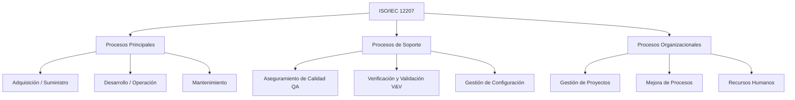

# ISO/IEC 12207: Procesos del Ciclo de Vida del Software

El estándar **ISO/IEC 12207** establece un marco de referencia común para describir el ciclo de vida del software, cubriendo la adquisición, suministro, desarrollo, operación, mantenimiento y retiro del software.

---

## Estructura de Procesos

El estándar organiza las actividades del ciclo de vida en tres grandes categorías de procesos:

---

## Detalle de los Procesos Clave

### 1. Procesos Principales (Primary Processes)
* **Desarrollo**: Incluye el análisis de requisitos, diseño de arquitectura, codificación, integración, pruebas y despliegue del software.
* **Operación**: Ejecución y soporte del software en su entorno productivo, atendiendo incidencias y apoyando a los usuarios en su uso.
* **Mantenimiento**: Modificación del software tras su entrega para corregir fallos (correctivo), mejorar rendimiento (perfectivo) o adaptarlo a nuevos entornos (adaptativo).

### 2. Procesos de Soporte (Supporting Processes)
* **Aseguramiento de la Calidad (QA)**: Proceso enfocado en dar confianza de que los productos y procesos de software cumplen con los requisitos definidos.
* **Verificación**: Evalúa si los productos de una fase cumplen con las condiciones impuestas al inicio de dicha fase (¿Estamos construyendo el producto correctamente? *Ej. Code reviews, linters, unit tests*).
* **Validación**: Determina si el producto final cumple con el uso previsto y los requisitos de negocio (¿Estamos construyendo el producto correcto? *Ej. User Acceptance Tests (UAT)*).
* **Gestión de Configuración (SCM)**: Controlar las versiones de los entregables y cambios en el código, asegurando la trazabilidad del código y artefactos.

### 3. Procesos Organizacionales (Organizational Processes)
* **Gestión**: Planificación, ejecución y control de recursos en el proyecto.
* **Infraestructura**: Establecimiento del hardware, herramientas de desarrollo, nubes y redes de comunicación necesarias.
* **Mejora**: Evaluación continua del rendimiento de los procesos para optimizar la entrega de software.
