# ISO/IEC 12207:2017: Procesos del Ciclo de Vida del Software

El estándar internacional **ISO/IEC 12207:2017** (desarrollado en conjunto con la IEEE) proporciona un marco de referencia común para describir y estructurar el ciclo de vida del software, cubriendo desde la conceptualización hasta el retiro de los sistemas de software.

> [!NOTE]
> **La regla de oro de ISO 12207: "El Qué, no el Cómo"**
> La norma establece las actividades y tareas indispensables que deben ejecutarse (el *qué hacer*), pero no impone una metodología de desarrollo específica. Corresponde a la organización adaptar la norma a sus prácticas de desarrollo, ya sea Cascada, Scrum, SAFe o flujos continuos basados en DevOps.

---

## Estructura de Procesos (ISO/IEC 12207:2017)

La versión de 2017 organiza el ciclo de vida en **4 grupos principales** que contienen un total de **30 procesos**:

```mermaid
graph TD
    A[ISO/IEC 12207:2017] --> B[Procesos de Acuerdo]
    A --> C[Procesos Habilitadores de Proyectos]
    A --> D[Procesos de Gestión Técnica]
    A --> E[Procesos Técnicos]

    B --> B1[Adquisición]
    B --> B2[Suministro]

    C --> C1[Gestión Ciclo Vida]
    C --> C2[Infraestructura]
    C --> C3[Portafolio]
    C --> C4[Recursos Humanos]
    C --> C5[Gestión Calidad]
    C --> C6[Gestión Conocimiento]

    D --> D1[Planificación]
    D --> D2[Evaluación y Control]
    D --> D3[Gestión Decisiones]
    D --> D4[Gestión Riesgos]
    D --> D5[Configuración]
    D --> D6[Gestión Información]
    D --> D7[Medición]
    D --> D8[Aseguramiento Calidad]

    E --> E1["Análisis Negocio (Misión)"]
    E --> E2[Requisitos Stakeholders]
    E --> E3[Requisitos Software]
    E --> E4[Arquitectura]
    E --> E5[Diseño]
    E --> E6[Análisis Sistema]
    E --> E7[Implementación]
    E --> E8[Integración]
    E --> E9[Verificación]
    E --> E10[Validación]
    E --> E11[Transición]
    E --> E12[Operación]
    E --> E13[Mantenimiento]
    E --> E14[Retirada]
```

---

## Detalle de los Grupos de Procesos

### 1. Procesos de Acuerdo (Agreement Processes - 2 Procesos)
Establecen las bases contractuales y comerciales entre la entidad que adquiere y la que provee el software.
* **Proceso de Adquisición (Acquisition):** Define las actividades para obtener un producto o servicio de software que satisfaga las necesidades del adquirente.
* **Proceso de Suministro (Supply):** Define las actividades para preparar y entregar un producto o servicio de software que cumpla con los términos contractuales del cliente.

### 2. Procesos Organizacionales de Habilitación de Proyectos (Organizational Project-Enabling Processes - 6 Procesos)
Aseguran que la organización disponga de la capacidad, infraestructura, recursos y cultura de calidad para ejecutar los proyectos eficazmente.
* **Gestión del Modelo de Ciclo de Vida (Life Cycle Model Management):** Definición y optimización de las políticas y modelos de ciclo de vida del software (ej. formalizar el flujo de Scrum/Kanban corporativo).
* **Gestión de Infraestructura (Infrastructure Management):** Provisión de hardware, nubes, redes y herramientas de desarrollo (ej. configurar servidores Kubernetes, entornos de staging y entornos integrados de desarrollo).
* **Gestión del Portafolio de Proyectos (Portfolio Management):** Selección e inicio de proyectos de software alineados con los objetivos estratégicos del negocio.
* **Gestión de Recursos Humanos (Human Resource Management):** Contratación, asignación y desarrollo de competencias técnicas y blandas de los ingenieros.
* **Gestión de Calidad (Quality Management):** Asegura que los productos cumplan con los objetivos de calidad organizacional e incrementen la satisfacción del cliente.
* **Gestión del Conocimiento (Knowledge Management):** Gestión y preservación del "know-how" del ciclo de vida del software (ej. mantener wikis técnicas, lecciones aprendidas).

### 3. Procesos de Gestión Técnica (Technical Management Processes - 8 Procesos)
Gestionan los recursos y actividades a nivel de proyecto para asegurar el cumplimiento de plazos, costos y calidad técnica.
* **Planificación del Proyecto (Project Planning):** Estimaciones y planes de lanzamiento realistas (ej. Release Planning ágil).
* **Evaluación y Control del Proyecto (Project Assessment and Control):** Medición continua de la ejecución frente a planes y toma de acciones correctoras (ej. Daily Scriptor, revisiones de Sprint).
* **Gestión de Decisiones (Decision Management):** Marco formal para resolver alternativas técnicas y arquitectónicas complejas.
* **Gestión de Riesgos (Risk Management):** Identificación y mitigación continua de riesgos de desarrollo o negocio.
* **Gestión de Configuración (Configuration Management):** Garantizar la trazabilidad e integridad de los artefactos y código base (ej. gobernanza en Git, control de versiones).
* **Gestión de Información (Information Management):** Creación y difusión de información técnica relevante a las partes interesadas autorizadas.
* **Proceso de Medición (Measurement):** Recopilación y análisis de métricas objetivas (ej. velocidad, cobertura de código, tasa de escape de bugs).
* **Aseguramiento de Calidad (Quality Assurance):** Auditoría e inspección para garantizar que el equipo siga los procesos de calidad corporativos e individuales del proyecto.

### 4. Procesos Técnicos (Technical Processes - 14 Procesos)
El núcleo técnico del estándar que describe las fases de ingeniería para transformar ideas en sistemas reales operativos.
* **Análisis de Negocio o Misión (Business or Mission Analysis):** Definir el problema del negocio o la oportunidad para buscar soluciones viables.
* **Definición de Necesidades y Requisitos de Stakeholders (Stakeholder Needs and Requirements Definition):** Recopilación y traducción de necesidades a alto nivel (ej. Product Backlog Refinement, épicas).
* **Definición de Requisitos del Sistema/Software (System/Software Requirements Definition):** Traducción a especificaciones técnicas y funcionales detalladas (ej. criterios de aceptación en Gherkin/BDD).
* **Definición de Arquitectura (Architecture Definition):** Estructurar el sistema en componentes físicos, lógicos e interfaces de integración.
* **Definición de Diseño (Design Definition):** Detallar los módulos de software a nivel de código y clases para guiar la implementación.
* **Análisis del Sistema (System Analysis):** Evaluar técnicamente el comportamiento y características de las alternativas de diseño.
* **Implementación (Implementation):** Traducir el diseño y requisitos en código ejecutable (fase de programación y pruebas unitarias).
* **Integración (Integration):** Ensamblar los diferentes módulos de software en un producto coherente.
* **Verificación (Verification):** Comprobar técnicamente que el software cumple con los requisitos del diseño (¿Construimos el sistema correctamente? *Ej. pruebas de integración, análisis estático*).
* **Validación (Validation):** Asegurar que el sistema final cumple con las expectativas reales de negocio y uso del usuario final (¿Construimos el sistema correcto? *Ej. User Acceptance Testing (UAT)*).
* **Transición (Transition):** Instalación, soporte inicial y capacitación para llevar el software de desarrollo a producción.
* **Operación (Operation):** Ejecutar el software en producción y dar soporte continuo al usuario final.
* **Mantenimiento (Maintenance):** Ejecución de cambios correctivos (bugs), adaptativos (nuevos entornos), perfectivos (nuevas funciones) o preventivos.
* **Retirada (Disposal):** Gestión ordenada del apagado y reemplazo del software obsoleto (evitando filtraciones de datos).
