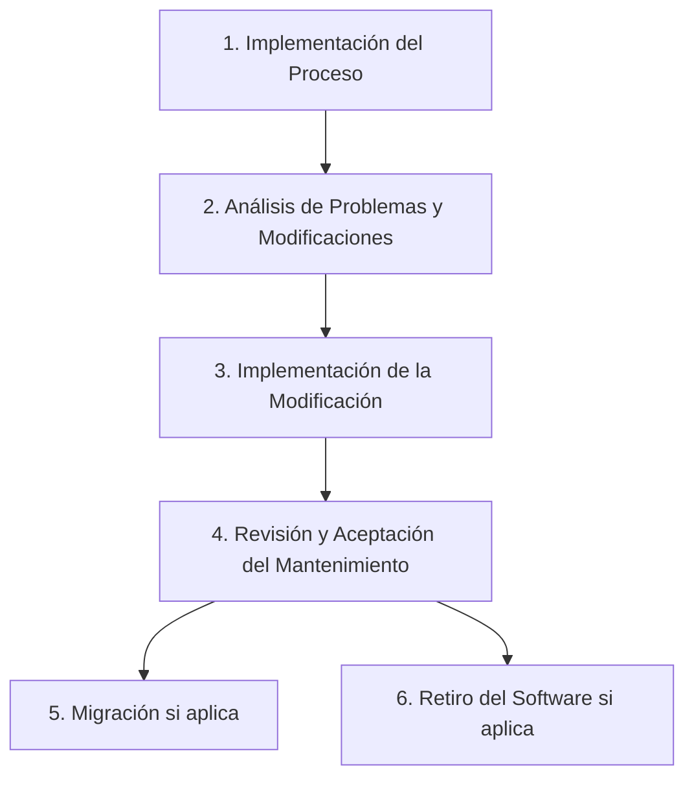
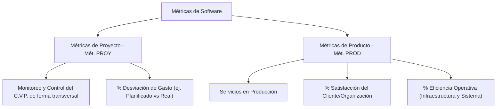
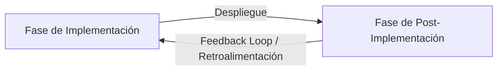

# Compendio e Implementación de Normas ISO en Ingeniería de Software

Este compendio centraliza, explica y ejemplifica las normas ISO clave mencionadas a lo largo de este playbook. El objetivo es proporcionar una referencia rápida, comprensible y orientada a la práctica real en proyectos de software.

---

## Índice de Normas Explicadas
1. [ISO 9001: Gestión de Calidad Organizativa](#1-iso-9001-gestión-de-la-calidad-organizativa)
2. [ISO/IEC 12207: Procesos del Ciclo de Vida del Software](#2-iso-iec-12207-procesos-del-ciclo-de-vida-del-software)
3. [ISO/IEC 25010: Modelo de Calidad del Producto de Software](#3-iso-iec-25010-modelo-de-calidad-del-producto-de-software)
4. [ISO/IEC 27001 y 27002: Seguridad de la Información (SGSI)](#4-iso-iec-27001-y-27002-seguridad-de-la-información-sgsi)
5. [ISO/IEC 15504 SPICE / ISO 330xx: Capacidad y Madurez de Procesos](#5-iso-iec-15504-spice--isoiec-330xx-capacidad-y-madurez-de-procesos)
6. [ISO/IEC 29110: Ciclo de Vida del Software para PYMEs](#6-iso-iec-29110-ciclo-de-vida-del-software-para-pequeñas-organizaciones-pymes)
7. [ISO/IEC 14764: Mantenimiento del Software](#7-iso-iec-14764-mantenimiento-de-software)
8. [ISO/IEC 15939: Proceso de Medición de Software](#8-iso-iec-15939-proceso-de-medición-de-software)
9. [Estándares Organizacionales: ISO 21500, ISO 30401 e ISO 56002](#9-estándares-organizacionales-auxiliares)

---

## 1. ISO 9001: Gestión de la Calidad Organizativa

* **¿Qué es?** El estándar global para diseñar e implementar un **Sistema de Gestión de la Calidad (SGC)** en cualquier tipo de organización.
* **Explicación sencilla:** No te dice cómo programar, sino cómo dirigir tu empresa de forma que siempre escuches al cliente, midas tus errores, capacites a tu gente y mejores continuamente tus procesos.
* **Ejemplo práctico:** Una software house define que toda queja de un cliente por fallas en producción debe registrarse en un software de tickets (como Jira Service Management), analizarse en una reunión mensual de mejora, y traducirse en acciones correctivas para que el bug no vuelva a ocurrir.
* **Integración Ágil:** Se alinea directamente con el principio de la **Retrospectiva del Sprint** (inspeccionar y adaptar los procesos del equipo de forma continua).

---

## 2. ISO/IEC 12207: Procesos del Ciclo de Vida del Software

* **¿Qué es?** El marco de referencia oficial que define **qué tareas y procesos** deben realizarse desde que se concibe una idea de software hasta que el sistema se retira del mercado.
* **Explicación sencilla:** Es un catálogo estructurado (30 procesos en la versión 2017) que describe todas las actividades de ingeniería de software (requisitos, diseño, código, pruebas, mantenimiento) y su gobernanza administrativa.
* **Ejemplo práctico:** Al iniciar el desarrollo de una aplicación bancaria, el equipo utiliza el *Proceso de Definición de Requisitos* para escribir historias de usuario detalladas, el *Proceso de Gestión de Configuración* para definir las políticas de ramificación (Git branching strategy) y el *Proceso de Integración* para configurar pipelines automatizados.
* **Integración Ágil:** Traduce los procesos técnicos tradicionales a tareas ágiles diarias: el refinamiento del backlog cubre la definición de requisitos, y las pruebas de aceptación de la demo del sprint cubren los procesos de validación.

---

## 3. ISO/IEC 25010: Modelo de Calidad del Producto de Software

* **¿Qué es?** El estándar para evaluar la **calidad técnica y funcional del código** y del producto entregado mediante 8 características principales.
* **Explicación sencilla:** Es una lista de comprobación técnica que ayuda a responder: ¿Es nuestro software rápido? ¿Es seguro? ¿Es fácil de modificar y mantener? ¿Es compatible con otros sistemas?
* **Ejemplo práctico:** Para garantizar la *Mantenibilidad*, la empresa configura SonarQube para medir el *Índice de Mantenibilidad* y bloquear cualquier Pull Request que contenga métodos con alta complejidad ciclomática o código duplicado. Para la *Fiabilidad*, se configuran servidores en la nube con escalamiento automático (auto-scaling) para asegurar que el sistema no se caiga bajo carga.
* **Integración Ágil:** Define directamente los **Criterios de Aceptación No Funcionales** de las historias de usuario y alimenta la Definition of Done (DoD).

---

## 4. ISO/IEC 27001 y 27002: Seguridad de la Información (SGSI)

* **¿Qué es?** El estándar que define cómo diseñar un **Sistema de Gestión de la Seguridad de la Información (SGSI)** (ISO 27001) y la guía detallada de los controles de seguridad aplicables (ISO 27002).
* **Explicación sencilla:** Es la norma para proteger los datos de tu empresa y clientes garantizando tres cosas (Tríada CIA): que solo entren personas autorizadas (Confidencialidad), que los datos sean correctos y no se alteren (Integridad), y que los servidores estén siempre activos (Disponibilidad).
* **Ejemplo práctico:** Una fintech exige que todos sus desarrolladores usen Autenticación de Doble Factor (2FA) para entrar a GitHub, prohíbe subir credenciales hardcodeadas (usando herramientas como GitGuardian), cifra la base de datos de usuarios en reposo y realiza simulacros mensuales de restauración de copias de seguridad (backups).
* **Integración Ágil:** Alimenta el pipeline de DevSecOps con análisis automatizados de seguridad (SAST/DAST) y auditorías en cada compilación (Daily Builds).

---

## 5. ISO/IEC 15504 (SPICE) / ISO/IEC 330xx: Capacidad y Madurez de Procesos

* **¿Qué es?** El modelo utilizado para evaluar el **nivel de madurez** y capacidad de los procesos de software dentro de una empresa en una escala del 0 al 5.
* **Explicación sencilla:** Sirve como termómetro para medir qué tan organizada es tu empresa: si trabaja de forma caótica (Nivel 0), si los proyectos son individuales y reactivos (Nivel 1), si hay procesos estandarizados corporativos (Nivel 3), o si se optimizan usando datos cuantitativos (Niveles 4 y 5).
* **Ejemplo práctico:** Una empresa evalúa su proceso de testing. Descubre que cada programador prueba "como quiere" (Nivel 1). Deciden formalizar una política de testing e implementar una herramienta corporativa estándar de automatización de pruebas para toda la organización, subiendo así al Nivel 3 (Establecido).
* **Integración Ágil:** Permite que las organizaciones midan la madurez de su transformación ágil de forma cuantitativa, asegurando que la agilidad no se limite a reuniones de Scrum sino que sea un proceso predecible y optimizado.

---

## 6. ISO/IEC 29110: Ciclo de Vida del Software para Pequeñas Organizaciones (PYMEs)

* **¿Qué es?** Una versión simplificada de ISO 12207 diseñada específicamente para **pequeñas organizaciones de software** (hasta 25 personas).
* **Explicación sencilla:** Las startups y PYMEs no tienen el dinero ni el personal para implementar los 30 procesos de la ISO 12207. Esta norma resume lo esencial en dos procesos clave: Gestión de Proyectos y Entrega de Software.
* **Ejemplo práctico:** Una startup de 5 desarrolladores adopta la ISO 29110. En lugar de documentar cientos de páginas de arquitectura, utilizan plantillas de 1 página para el Project Charter, definen un flujo sencillo de control de cambios, y unifican su repositorio de código en una sola rama para agilizar despliegues.
* **Integración Ágil:** Ideal para startups que usan Scrum o Kanban y necesitan demostrar formalidad de procesos ante grandes clientes corporativos o licitaciones públicas sin perder agilidad.
* **Cuadro Comparativo con ISO/IEC 12207:**

| Característica | ISO/IEC 12207 | ISO/IEC 29110 (Perfil Básico) |
| :--- | :--- | :--- |
| **Audiencia Objetivo** | Medianas y grandes organizaciones, proyectos complejos. | Micro y pequeñas empresas (VSEs - hasta 25 personas). |
| **Enfoque de Procesos** | Todo el ciclo de vida completo (más de 30 procesos detallados). | Foco simplificado en **2 procesos**: Gestión de Proyectos (PM) e Implementación de Software (SI). |
| **Procesos Organizacionales** | Incluye gestión de portafolio, recursos humanos, conocimiento e infraestructura. | No los incluye de manera formal, dejando que la organización los defina libremente. |
| **Acuerdos y Contratos** | Procesos formales de adquisición y suministro. | Simplificados dentro de la gestión del proyecto y compromisos con el cliente. |
| **Mantenimiento y Soporte** | Proceso independiente y detallado ([ISO/IEC 14764](file:///d:/Jorge/project-management-playbook/03-software-quality-standards/iso-standards-compendium.md#7-iso-iec-14764-mantenimiento-de-software)). | Integrado de forma simplificada en el ciclo de vida de la entrega. |

---

## 7. ISO/IEC 14764: Mantenimiento de Software

* **¿Qué es?** El estándar internacional que proporciona directrices detalladas para la gestión, planificación, ejecución y control de la fase de **mantenimiento del software** tras su puesta en producción.
* **Explicación sencilla:** Define cómo debe reaccionar y organizarse el equipo técnico cuando el software ya está siendo usado por clientes reales y requiere cambios, mejoras o correcciones.

### Los 4 Tipos de Mantenimiento de Software
La norma clasifica las modificaciones del sistema en cuatro tipos principales:
1. **Correctivo (Corrective):** Corrección reactiva de fallos o bugs detectados en producción (ej. solucionar un error de cálculo en la pasarela de pagos).
2. **Preventivo (Preventive):** Modificación del software para mejorar su mantenibilidad o prevenir fallos antes de que ocurran (ej. refactorización de código complejo, actualización de dependencias obsoletas).
3. **Adaptativo (Adaptive):** Modificación para mantener el software operativo en entornos tecnológicos cambiantes (ej. migrar la aplicación de servidores locales a AWS, adaptarla a una nueva versión de iOS o Android).
4. **Perfectivo (Perfective):** Modificaciones evolutivas destinadas a añadir nuevas funcionalidades, mejorar el rendimiento o la usabilidad a petición del negocio o el cliente (ej. implementar autenticación biométrica en el login).

### Las 6 Actividades Clave de la Norma
La ISO/IEC 14764 establece que un proceso formal de mantenimiento debe ejecutar seis actividades fundamentales:

1. **Implementación del Proceso:** Planificación inicial de la estrategia de soporte, definición del flujo de recepción de tickets, y establecimiento de herramientas para la gestión de configuración y control de versiones.
2. **Análisis de Problemas y Modificaciones:** Recepción de la solicitud, replicación y validación del fallo en entornos controlados, estimación de impacto técnico/costo, y obtención de la autorización formal para aplicar el cambio.
3. **Implementación de la Modificación:** Diseño, codificación y pruebas unitarias/integradas del cambio (utilizando los mismos estándares de calidad empleados en la fase de desarrollo).
4. **Revisión y Aceptación del Mantenimiento:** Validación técnica y funcional del cambio por un equipo de QA o el cliente, garantizando la integridad de todo el sistema.
5. **Migración:** Planificación y ejecución del traslado del software a un nuevo entorno físico o virtual en caso de obsolescencia tecnológica, garantizando la persistencia y compatibilidad de los datos históricos.
6. **Retiro del Software (Desinstalación):** Plan de cese de operaciones de un módulo o sistema entero, notificando a los usuarios finales, archivando los datos sensibles de forma segura y eliminando dependencias activas.

* **Ejemplo práctico:** Un usuario reporta mediante Jira que el portal de facturación rechaza tarjetas extranjeras. El equipo de soporte técnico valida el problema (Análisis), determina que es una falla de código (Mantenimiento Correctivo), realiza el ajuste en el microservicio de pagos (Implementación), ejecuta las pruebas de regresión automatizadas (Aceptación) y despliega el hotfix a producción.
* **Integración Ágil:** Permite a los Product Owners y Scrum Masters clasificar y priorizar el *Sprint Backlog* de soporte técnico, asignando puntos de historia y definiendo *Definición de Hecho (DoD)* rigurosos para cada tipo de intervención de mantenimiento.

## 8. ISO/IEC 15939: Proceso de Medición de Software

* **¿Qué es?** El estándar internacional que define las actividades, tareas y directrices para planificar, recopilar, analizar y reportar **métricas en proyectos de software**, con el fin de guiar el Monitoreo y Control (M&C).
* **Explicación sencilla:** Te ayuda a definir qué vas a medir, cómo recopilar los datos objetivamente y cómo usar indicadores en lugar de suposiciones para tomar decisiones.

### Modelo de Estructuración de Métricas (Proyecto vs. Producto)
De acuerdo con las mejores prácticas y el ciclo de vida del software, las métricas se dividen formalmente en dos grandes grupos:

#### A. Métricas de Proyecto (Mét. PROY)
Monitorean de forma transversal el **Ciclo de Vida del Proyecto (C.V.P.)** desde la planificación hasta el cierre. Se enfocan en el proceso de **Monitoreo y Control (M&C)** de recursos, cronograma y costos.
* **Porcentaje de Desviación de Gasto (% Gasto):** Mide el desvío financiero del proyecto comparando el presupuesto Planificado ($P$) vs. el costo Real ($R$).
  $$\% \text{ Desviación Gasto} = \left( \frac{\text{Costo Real} - \text{Presupuesto Planificado}}{\text{Presupuesto Planificado}} \right) \times 100$$
  * *Ejemplo (de pizarra):* Si el presupuesto planificado es de $20k y el real es de $30k, la desviación es del $+50\%$.

#### B. Métricas de Producto y Operación (Mét. PROD)
Monitorean el rendimiento del software ya desplegado como un **Servicio en Producción**.
* **% de Satisfacción del Cliente/Organización:** Nivel de aceptación del software por parte de los usuarios finales y la organización.
* **% de Eficiencia Operativa (% de ef. op.):** Rendimiento de la infraestructura física o en la nube (ej. Uptime/Disponibilidad, tasa de error de red, uso de CPU/RAM).

---

### Clasificación: Implementación vs. Post-Implementación
El control del proyecto exige métricas diferenciadas en el desarrollo activo (Implementación) y en la puesta en marcha (Post-Implementación):

| Categoría | Métrica | Tipo de Marco | Descripción / Fórmula |
| :--- | :--- | :--- | :--- |
| **Implementación** | **% de Requisitos Revisados (% Req. Rev.)** | Tradicional / RUP (12207/29110/14764) | Grado de avance en la revisión, refinamiento y trazabilidad de los requisitos de software. |
| **Implementación** | **% de Pruebas de Aceptación (% Prueb. Acept.)** | Tradicional / RUP (12207/29110/14764) | Casos de prueba de aceptación completados con éxito frente al total diseñado. |
| **Implementación** | **% de Historias de Usuario terminadas (% H.U. term.)** | Ágil (Scrum) | Porcentaje de entregables / historias completadas respecto al backlog planificado del Sprint. |
| **Implementación** | **% de elementos del Backlog logrados/priorizados** | Ágil (Scrum) | Eficiencia en la priorización del backlog de producto por parte del Product Owner. |
| **Post-Implementación** | **% de Satisfacción del Cliente** | Transversal / Cliente | Nivel de satisfacción recogido mediante encuestas CSAT post-entrega. |
| **Post-Implementación** | **% de Eficiencia del Software / Cliente** | Transversal / Cliente | Mide la reducción de tiempo/esfuerzo del negocio del cliente al usar el nuevo software. |
| **Post-Implementación** | **% de Uso del Software / Cliente (Adopción)** | Transversal / Cliente | Nivel de adopción real del software en los flujos diarios del negocio. |

* **Feedback Loop (Retroalimentación):** La post-implementación retroalimenta a la implementación. Los errores encontrados, estadísticas de rendimiento y problemas de adopción analizados en producción (Post-Implementación) sirven para refinar los requisitos, planes y pruebas del siguiente ciclo de desarrollo (Implementación).
* **Integración Ágil:** Proporciona los indicadores cuantitativos necesarios para los tableros de control en Grafana o Jira, vinculando los objetivos comerciales con el avance técnico del equipo.

---

## 9. Estándares Organizacionales Auxiliares

### A. ISO 21500 (Gobernanza y Gestión de Proyectos)
* **¿Qué es?** Directrices y conceptos de alto nivel para gestionar proyectos de manera estructurada en la organización.
* **Aplicación:** Sirve para unificar el lenguaje y los procesos de gestión entre la Oficina de Proyectos (PMO) tradicional y los equipos que operan con marcos ágiles (Scrum/Kanban).

### B. ISO 30401 (Sistemas de Gestión del Conocimiento)
* **¿Qué es?** Requisitos para establecer sistemas y cultura que fomenten la creación, retención e intercambio del conocimiento organizacional.
* **Aplicación:** En software, esto se traduce en eliminar silos de conocimiento mediante la documentación estructurada de arquitecturas (ej. en Confluence), y la realización sistemática de capacitaciones internas (Brown Bag Sessions) y pair programming.

### C. ISO 56002 (Gestión de la Innovación)
* **¿Qué es?** Guía para establecer y mantener un sistema de gestión de la innovación para responder rápidamente a los cambios del mercado.
* **Aplicación:** Fomenta la creación de células de innovación técnica en la empresa (ej. organizar Hackathons trimestrales, dar tiempo dedicado de investigación a desarrolladores) para construir prototipos rápidos y probar nuevas tecnologías sin interrumpir el flujo del negocio core.
