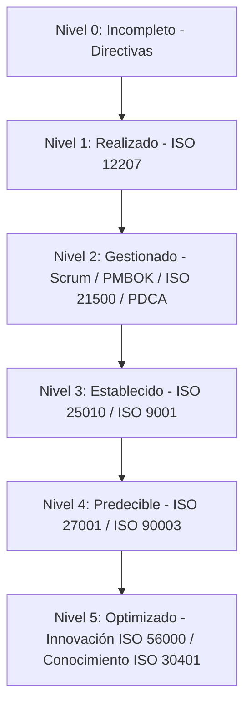

# Modelo de Evaluación de Madurez y Capacidad de Procesos (ISO/IEC 15504 / ISO/IEC 33000)

> [!NOTE]
> **Evaluación y Habilitación Organizacional**
> Para que una organización de software mejore continuamente, debe evaluar de forma objetiva la capacidad de sus procesos actuales. El estándar **ISO/IEC 15504** (también conocido como **SPICE**) y su evolución **ISO/IEC 33000** proporcionan un modelo bidimensional para evaluar la madurez de los procesos y la capacidad de la organización.

---

## 1. Niveles de Madurez de Capacidad de Procesos y Marcos Recomendados

A continuación se detalla la escala de madurez (niveles del 0 al 5) según el estándar de capacidad, junto con las recomendaciones y marcos de referencia (normas ISO, metodologías ágiles y guías de gestión) asociados a cada nivel para habilitar su cumplimiento:

| Nivel | Descripción | Descripción de Capacidad | Marcos y Estándares Recomendados (Rec.) |
| :---: | :--- | :--- | :--- |
| **0** | **INCOMPLETO** *(Incomplete)* | El proceso no se implementa o no logra cumplir con su propósito establecido. Existe poca o ninguna sistematización. | • Directivas organizacionales básicas. • Procedimientos informales no estandarizados. |
| **1** | **REALIZADO** *(Performed)* | El proceso logra cumplir con su propósito, pero de manera reactiva e individualizada por proyecto. | • **[ISO/IEC 12207](iso-iec-12207.md):** Procesos base de ciclo de vida ejecutados de forma técnica. |
| **2** | **GESTIONADO** *(Managed)* | El proceso se planifica, supervisa y ajusta de forma sistemática. Los entregables se establecen y controlan de acuerdo a planes. | • **[PMBOK® / Scrum](01-agile-frameworks/scrum-and-kanban.md):** Marcos de gestión y roles definidos. • **ISO 21500:** Directrices para la gestión de proyectos. • **Ciclo PDCA/PECA:** Mejora iterativa a nivel operativo. |
| **3** | **ESTABLECIDO** *(Established)* | El proceso gestionado se implementa utilizando un proceso estándar definido y documentado a nivel de toda la organización. | • **[ISO/IEC 25010](quality-models-iso-25010.md):** Modelos formales de calidad de producto. • **ISO 9001:** Enfoque sistemático en la Gestión de la Calidad (Q) organizativa. |
| **4** | **PREDECIBLE** *(Predictable)* | El proceso establecido opera de manera estable dentro de límites definidos cuantitativamente para lograr sus resultados. | • **[ISO/IEC 27001 / 27002](information-security-iso27001.md):** Seguridad de la información integrada. • **[ISO/IEC 12207](iso-iec-12207.md):** Procesos maduros del ciclo de vida. • **[ISO/IEC 25010](quality-models-iso-25010.md):** Atributos de calidad medidos cuantitativamente. • **ISO/IEC 90003:** Directrices de aplicación de ISO 9001 en desarrollo de software. • **ISO 21500:** Gobernanza estructurada de proyectos. |
| **5** | **OPTIMIZADO** *(Optimizing)* | El proceso se mejora continuamente para cumplir con los objetivos comerciales actuales y futuros de la organización. | • **Marcos Integrados:** Coexistencia de ISO 25010, ISO 9001, ISO 21500 e ISO 12207. • **ISO 56000 / 56002:** Sistemas de Gestión de la Innovación. • **ISO 30401:** Sistemas de Gestión del Conocimiento. |

---

## 2. Relación de los Estándares en el Ciclo de Madurez

El modelo de madurez actúa como una hoja de ruta evolutiva para la ingeniería y gobernanza del software:

* **Transición del Caos a la Agilidad (Nivel 0 al Nivel 2):** Se implementan marcos ágiles (Scrum, Kanban) y el ciclo PECA para estructurar y gestionar el trabajo diario antes de buscar certificaciones de procesos complejos.
* **Institucionalización (Nivel 3):** Las buenas prácticas se expanden a toda la compañía. Se formalizan los modelos de calidad del producto (ISO 25010) y se unifica la calidad organizativa (ISO 9001).
* **Control Cuantitativo e Innovación (Nivel 4 al Nivel 5):** Se integran la seguridad robusta (ISO 27001), la gobernanza de conocimiento (ISO 30401) y la gestión sistemática de la innovación (ISO 56000) para garantizar que la mejora sea continua y el negocio permanezca a la vanguardia.
