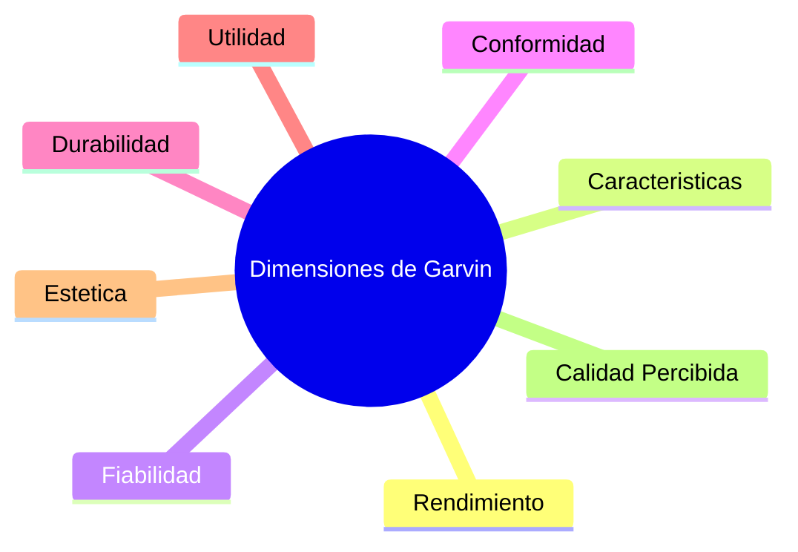

# Fundamentos de Calidad de Software: Conceptos y Gurús

> [!NOTE]
> **El Concepto de Calidad Integrada (Built-in Quality)**
> La calidad en el software no es una capa externa que se añade mediante inspección (pruebas manuales) antes de entregar. La calidad real se integra en el diseño de la arquitectura, en la disciplina de codificación y en los procesos de automatización del equipo.

---

## 1. Dicotomía Calidad vs. Grado (Grade)

De acuerdo con el PMBOK® y el estándar ISO 9000, la calidad y el grado son conceptos distintos pero estrechamente relacionados que todo gestor de proyectos debe administrar de manera transparente:

* **Calidad (Quality):** Es el grado en que un conjunto de características inherentes a un producto o servicio cumple con los requisitos establecidos (satisfacción de necesidades implícitas o explícitas del cliente, y ausencia de defectos).
* **Grado (Grade):** Es una categoría de clasificación que se asigna a entregables que tienen el mismo uso funcional pero diferentes características técnicas o de diseño. Indica la riqueza de funcionalidades o atributos técnicos del producto.

### Comparación de Escenarios
| Clasificación | Grado Alto | Grado Bajo |
| :--- | :--- | :--- |
| **Calidad Alta** | **Ideal:** Sistema con abundantes funcionalidades que opera a la perfección, sin bugs apreciables y alta disponibilidad.<br>*(Ej. Un ERP completo que funciona sin caídas).* | **Aceptable:** Sistema con funcionalidades sencillas y limitadas, pero que funciona de forma impecable sin errores.<br>*(Ej. Una app web con solo un formulario básico pero 100% confiable).* |
| **Calidad Baja** | **Un Problema Crítico:** Sistema robusto con alta complejidad y muchas características sofisticadas, pero lleno de bugs y caídas constantes.<br>*(Ej. Una app móvil con IA integrada que se cierra sola).* | **Fracaso Absoluto:** Aplicación básica y sin funciones complejas que además no funciona correctamente y tiene errores.<br>*(Ej. Un validador de textos simple que produce errores de cálculo).* |

> [!IMPORTANT]
> **Decisiones de Compromiso y Limitación de Recursos**
> Ante presiones del cronograma (como reducir un proyecto de 12 a 6 meses), el equipo de gestión tiene varios recursos clásicos de compresión:
> 1. **Crashing (Intensificación):** Adición de recursos (costo adicional).
> 2. **Fast Tracking (Ejecución Rápida):** Tareas en paralelo (riesgo de retrabajo).
> 3. **Reducir el Alcance:** Disminución de la funcionalidad.
> 
> En teoría, **reducir la calidad nunca debe ser una opción**. Si es necesario ajustar el proyecto para cumplir con los plazos o costes, la estrategia correcta es **reducir el grado** (quitar funcionalidades no críticas o MVP), manteniendo el nivel de calidad o confiabilidad de lo que sí se entregue.
> 
> **Advertencia sobre el Grado:** Si se baja el grado del producto para cumplir el cronograma, se debe prever el impacto en la arquitectura de software. Incrementar el grado posteriormente (agregar funcionalidades) sobre una arquitectura no escalable puede ser tan costoso como reconstruir el sistema desde cero.

---

## 2. Las 8 Dimensiones de Calidad de David Garvin (1988)

David Garvin propuso un marco conceptual de 8 dimensiones para definir y analizar la calidad, aplicable al desarrollo de software:



1. **Rendimiento (Performance):** Las características operativas básicas del software (ej. tiempos de respuesta de la API bajo carga, velocidad de carga de la interfaz).
2. **Características (Features):** Los extras o complementos del sistema que van más allá del funcionamiento básico (ej. soporte multi-idioma, modos oscuros, exportación a múltiples formatos).
3. **Fiabilidad (Reliability):** La probabilidad de que el software no falle en un período de tiempo bajo ciertas condiciones (ej. tiempo medio entre fallos (MTBF), estabilidad del sistema).
4. **Conformidad con las Especificaciones (Conformance):** El grado en que el diseño y las características operativas del software cumplen con los estándares y requerimientos técnicos definidos (ej. cumplir con el estándar OWASP, pasar todas las pruebas de aceptación).
5. **Durabilidad (Durability):** La vida útil del sistema y la facilidad de mantenimiento a largo plazo antes de que la deuda técnica o la obsolescencia obliguen a retirarlo.
6. **Utilidad / Servicio (Serviceability):** La rapidez y facilidad con la que se pueden resolver los problemas o caídas del sistema (ej. tiempo medio de reparación (MTTR), disponibilidad de logs detallados e instrumentalización).
7. **Estética (Aesthetics):** El aspecto visual del software, su interfaz gráfica (UI) y la experiencia de usuario (UX).
8. **Calidad Percibida (Perceived Quality):** La reputación de la marca y la valoración subjetiva que el usuario le da al software en base a sus experiencias pasadas.

---

## 3. Filosofías y Gurús de la Calidad

La calidad moderna del software hereda los principios de los grandes gurús industriales:

* **Walter Shewhart (El Padre del Control Estadístico):**
  * Creador del **Ciclo PECA** (Planear - Ejecutar - Comprobar - Ajustar / PDCA) para la mejora y mantenimiento continuos.
  * Pionero en el **Control Estadístico de Procesos (SPC)**, enfocado en reducir la variabilidad del proceso para estabilizar y predecir los resultados.
* **W. Edwards Deming (El Impulsor del Kaizen):**
  * Demostró la **Reacción en Cadena de Deming**: *Mejorar la Calidad $\rightarrow$ Reducir Costos (menos reproceso/errores) $\rightarrow$ Aumentar la Productividad $\rightarrow$ Conquistar el Mercado $\rightarrow$ Permanecer en el Negocio*.
  * Creó los **14 Puntos de Deming** para la transformación organizacional (eliminación de barreras entre departamentos, erradicación de slogans vacíos, educación continua, etc.).
* **Joseph M. Juran (Adecuación al Uso):**
  * Definió la calidad como la **"Adecuación al Uso" (Fitness for Use)**, es decir, el grado en que el producto satisface las necesidades reales del usuario en la operación diaria.
  * Introdujo la Trilogía de Juran: Planificación de la Calidad, Control de la Calidad y Mejora de la Calidad.
* **Philip B. Crosby (Cero Defectos):**
  * Creador del concepto de **"Cero Defectos"** y de la premisa de que **"La calidad es gratis"**: no cuesta dinero hacer las cosas bien a la primera, lo que cuesta dinero son los fallos y no cumplir con los requisitos.
  * Formuló los **5 Absolutos de la Calidad**:
    1. Calidad significa conformidad con los requisitos.
    2. Los problemas de calidad son en realidad problemas de incumplimiento.
    3. No existen ahorros al sacrificar la calidad.
    4. La única medida de desempeño es el costo de la calidad.
    5. El único estándar de desempeño aceptable es el de Cero Defectos.
* **Kaoru Ishikawa (Calidad Democrática):**
  * Diseñó los **Diagramas de Ishikawa** (causa-efecto o "espina de pescado") para estructurar y rastrear el origen de los problemas analizando personas, procesos, tecnología y entorno.
  * Desarrolló los **Círculos de Calidad**, que son grupos voluntarios de operarios/desarrolladores enfocados en buscar e implementar mejoras en su trabajo diario.
* **Taiichi Ohno (El Creador de Lean y JIT):**
  * Vicepresidente de Toyota Motors que conceptualizó el sistema **Just-In-Time (JIT)**: hacer sólo lo que se necesita, cuando se necesita y en la cantidad que se necesita.
  * Enfocado en identificar y eliminar sistemáticamente los desperdicios en el flujo de valor para optimizar la eficiencia general.

---

## 4. Costos de la Calidad (CoQ - Cost of Quality)

El Costo de la Calidad no es el coste de crear un buen producto; es el costo financiero que asume una organización por **NO hacer bien las cosas a la primera**. Se divide en cuatro categorías principales:

```text
                        COSTOS DE LA CALIDAD (CoQ)
                                     │
           ┌─────────────────────────┴─────────────────────────┐
           ▼                                                   ▼
 Costos de Conformidad                               Costos de No Conformidad
 (Inversiones de control)                            (Costo de las fallas)
     ├── Prevención                                      ├── Fallas Internas
     └── Evaluación                                      └── Fallas Externas
```

### A. Costos de Conformidad (Costo de Prevenir y Medir)
* **Costos de Prevención (Prevention Costs):** Dinero invertido para asegurar que no ocurran defectos en primer lugar.
  * *Ejemplos en software:* Planificación de planes de QA, redacción de estándares de desarrollo y guías de estilo, capacitación técnica al equipo de desarrollo, compra de herramientas de análisis estático, y evaluaciones de capacidad del proceso (ej. CMMI).
* **Costos de Evaluación (Appraisal Costs):** Costes para medir, inspeccionar y evaluar si los entregables cumplen los requisitos técnicos antes de liberarse.
  * *Ejemplos en software:* Revisiones de requerimientos y diseño (design reviews), inspecciones de código base (peer code reviews), desarrollo de casos de prueba y ejecución de la primera ronda de pruebas del sistema (QA).

### B. Costos de No Conformidad (Costo de las Fallas)
* **Costos de Fallas Internas (Internal Failure Costs):** Costos de reparar errores detectados por el equipo **antes** de que el software llegue a manos del cliente.
  * *Ejemplos en software:* Diagnóstico de fallos, refactorización y reescritura de código con errores (retrabajo), reinspección de código corregido, ejecución de pruebas de regresión adicionales, y desecho de código inutilizable.
* **Costos de Fallas Externas (External Failure Costs):** Costos devastadores en los que se incurre cuando los defectos son detectados **después** de entregar el producto al usuario final.
  * *Ejemplos en software:* Gestión de reclamaciones y quejas del cliente, despliegue de parches urgentes de producción (hotfixes), soporte técnico adicional, multas por incumplimiento de acuerdos de nivel de servicio (SLA), indemnizaciones, daño a la reputación corporativa y proyectos cancelados por insatisfacción.

---

## 5. Curva de Costo Relativo de Reparación de Defectos

Investigaciones del **IBM System Sciences Institute** demuestran que el coste de corregir un error se incrementa de forma exponencial a medida que el defecto avanza por las fases del ciclo de vida del software:

```text
  $500 ┼─────────────────────────────────────────────────────────────── [Producción / Mantenimiento]
       │
  $240 ┼────────────────────────────────────────── [Validación / QA]
       │
  $40  ┼──────────────────────────── [Integración / System Test]
       │
  $10  ┼──────────────── [Codificación / Unit Test]
       │
  $5   ┼──────── [Diseño / Arquitectura]
       │
  $1   ┼─ [Requisitos]
  ─────┴─────────┴─────────┴─────────┴─────────┴─────────┴─────────┴─────
       Requisitos Diseño  Código Integración Validación Producción
```

### Implicancia para Líderes Técnicos
Esta curva justifica el enfoque moderno de **Shift-Left Testing** (mover las pruebas a la izquierda): al incorporar controles de calidad (QA) y pruebas automatizadas lo más temprano posible en el ciclo de vida (desde la fase de requisitos y diseño técnico), se reducen de manera drástica los costes del proyecto y se garantiza la entrega de valor al negocio.
